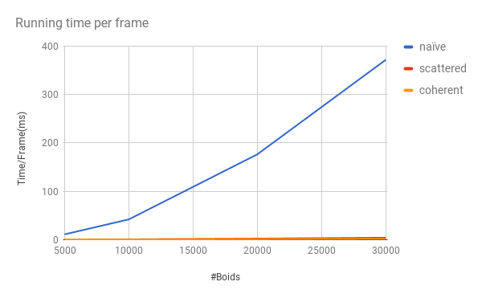
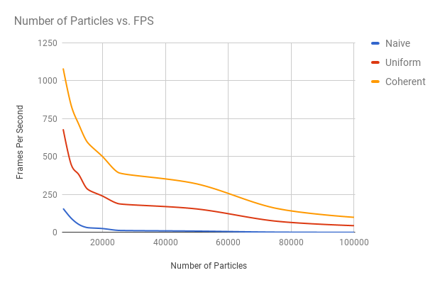
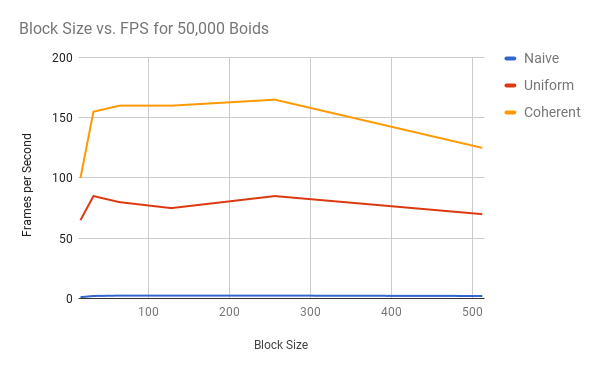
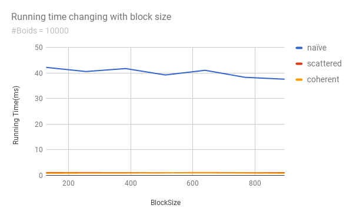
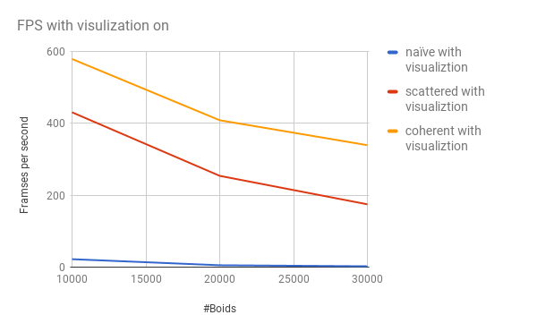

**University of Pennsylvania, CIS 565: GPU Programming and Architecture,
Project 1 - Flocking**

* Pennid: lujiayi Name: Jiahao Liu
* Tested on: (TODO) Windows 10, i7-3920XM CPU @ 2.90GHz 3.10 GHz 16GB, GTX 980m SLI 8192MB (personal computer)

# Render Result with Vsync on

# Chart Showing Without Visualization

# Chart Showing With Visualization

