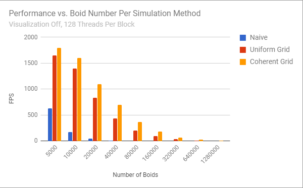

**University of Pennsylvania, CIS 565: GPU Programming and Architecture,
Project 1 - Flocking**

* Joseph Klinger
* Tested on: Windows 10, i5-7300HQ (4 CPUs) @ ~2.50GHz 2B, GTX 1050 6030MB (Personal Machine)

### README

In this project, we are attempting to simulation the motion of "Boids," which move each frame according to the properties of their neighbors. This can be done a number of ways,
one of the better ones being to utilize a spatial uniform grid to accelerate the processing of each boid being simulated. On the CPU (even with an acceleration structure such as a uniform grid in place),
we would be forced to iterate over each boid to process them individually, which is valid, but doesn't scale up well. So, we harness the power of the GPU through CUDA to simulate these Boids in parallel.

The naive way of computing how a Boid should move is to check every other Boid in the simulation. However, Boids have a finite (and usually small) neighborhood radius, and only are affected by Boids within that radius.
Ideally, we do not have to bother checking faraway Boids that will have no effect on the Boid in question. As mentioned before, a Uniform Grid is utilized to narrow down the Boid that must be checked to only those in the
cells next to a given Boid. To further accelerate things, steps are taken to ensure that the arrays containing the Boid information (position and velocity) are arranged in the same way as the uniform grid indices for faster
read times - see INSTRUCTION.md for more.

### Analysis

**Data**

I'm just going to throw some stats at you. Here are how the various implementations performed:

Here we see that the naive implementation falls off rather quickly, as we would expect. The uniform grid blows that out of the water, and the coherent memory optimization is still appreciably better than that!

Turning off the visualization allows for awesomely high performance, but only when using one of the grid implementations.

As we will discuss below, the warp size on my laptop's GPU, the GTX 1050, is 32, so the performance plateau's after increasing the blocksize to 32, as expected.

**Questions:**
* For each implementation, how does changing the number of boids affect
performance? Why do you think this is?
Changing the number of boids, or the input "N," has the most direct effect on the performance of the simulation.
Each method (Naive, Uniform Grid, Coherent Grid) processes each boid to compute a new velocity (for that boid).
Each method must take into account a subset of the other boids to do this. So, the method that can take into account as few of
the other boids for a given boid will perform the best. Obviously, taking into account every other boid (Naive) will perform far worse
than taking into account only the nearby boids (Uniform Grid).

* For each implementation, how does changing the block count and block size
affect performance? Why do you think this is?
By changing the block size (and therefore block count), we are directly altering exactly how many boids are processed in parallel at a time. Given that on a GTX 1050, a maximum of 32 threads can be processed at once
in parallel, it makes sense that performance increase would plateau after increasing the number of threads per block to 32, as seen in the third graph above. Any number lower than 32, and the SMs aren't being used to their full
potential (not every thread in a warp of 32 threads would be active), and so we witness less performance.

* For the coherent uniform grid: did you experience any performance improvements
with the more coherent uniform grid? Was this the outcome you expected?
Why or why not?
Comparing to the scattered uniform grid implemenation, adding memory coherence to the boid position/velocity arrays added a 10 - 40% performance increase (!!!) in certain cases, which is very appreciable! This was higher than
I was initially expecting, but it puts into perspective how costly it can be to derefence pointers to global memory repeatedly. In future projects, I will be sure to incorporate optimizations such as this.

* Did changing cell width and checking 27 vs 8 neighboring cells affect performance?
Why or why not?
Intuitively, we know that checking more cells than is necessary will negatively affect performance. Given that the grid cell size is two times the neighborhood distance, in three dimensions, only 8 grid cells even need to be checked.
However, here is a brief analysis on how 