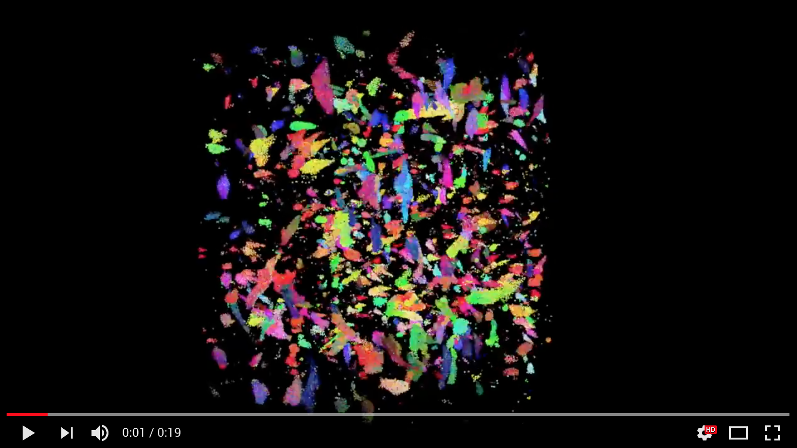
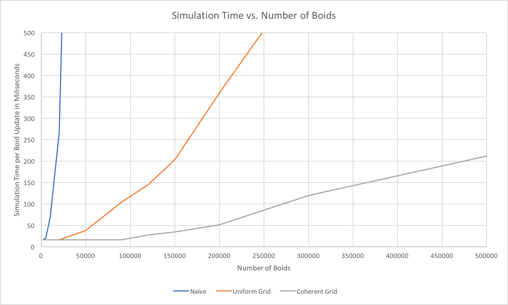

**University of Pennsylvania, CIS 565: GPU Programming and Architecture,
Project 1 - Flocking**

[](https://www.youtube.com/watch?v=g5J5UmyLcXA)

* Daniel Daley-Mongtomery
* Tested on: MacBook Pro, OSX 10.12, i7 @ 2.3GHz, 16GB RAM, GT 750M 2048MB (Personal Machine)

### Details

  The [boids](https://en.wikipedia.org/wiki/Boids) algorithm by Craig Reynolds uses three simple rules to simulated flocking motions movement of virtual agents:
  
>**1. Cohesion** - Boids move towards the perceived center of mass of their neighbors
>
>**2. Separation** - Boids avoid getting to close to their neighbors
>
>**3. Alignment** - Boids generally try to move with the same direction and speed as their neighbors

  Boids poll for these behaviors within a specified radius of influence, ignoring boids outside of that radius. This makes for an embarrassingly parallel system and a perfect opportunity to try out Nvidia's CUDA API and simulate as many birds as possible.
  
##### Basic Implementation

  At the most naive level we can perform a doubly-nested loop, like so:
  ```
  for every boid i in parallel {
    for every bird j {
      if (distance(i,j) < radius) i.flockWith(j)
    }
  }
  ```
  
  While this earns us some parallelism, we're likely performing thousands to hundreds of thousands of unecessary distance checks *for every boid*, and *on every step*. Instead, we'd like to know specifically where to look for nearby boids.
  
##### Uniform Grid

  Instead of having every boid perform a position classification, I had the sysytem itself perform one such classification at the beginning of every step. This O(n) step to classify and sort the boids beforehand required a DxDxD grid, where D represented the diameter of the boids' area of influence. This way, a boids had to consult at most 4 grid cells to instantly know all of its neigbors.
  

  
  Rather than bucketing the boids in memory, however, we can speed things up by representing the grid in a buffer of indices, each of which represent the index of the first boid to be stored at the cell. From the index of cell A, until I reached the index stored for some cell B, all in between boids belong to cell A. Cells with no boids stored -1 and were ignored.
  


In order to traverse the boids in this way, their representative indices must be sorted by their corresponding cell. For this, I used [thrust](https://github.com/thrust/thrust).

##### Coherent Grid

  Since we're sorting boids anyway, why not speed up boid lookup by sorting their position and velocity vectors. This way, instead of recieving a handful of data indices and retrieving each destination, we can simply receive a handful of boid data directly. 
  

  
  This level of indirection seems like a minor optimization, but had a huge impact on performance. Below is the result of each method for different numbers of boids:
  


  Being my first time using CUDA, the cost of memory lookup was a huge surprise to me. I imagine that by leveraging shared memory to preemptively send nearby information to boid kernels could further improve performance. An important note is that these figures represent something like a stabilized time; all methods performed better at first, but slowed down as birds left their initial uniform distribution.
  
  I performed some experiments into the effects of changing the influence radius of the boids, but doing so fundamentally changes the result of the simulation and so can not be reasonably compared.
