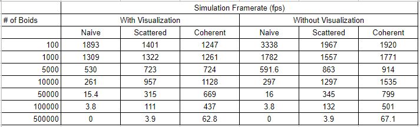
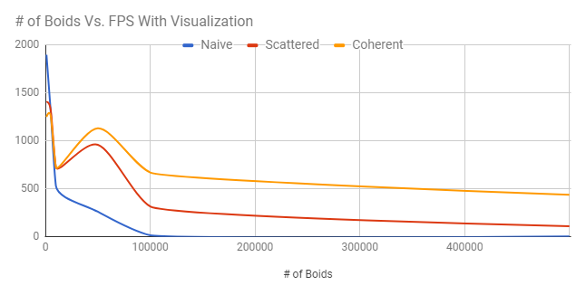
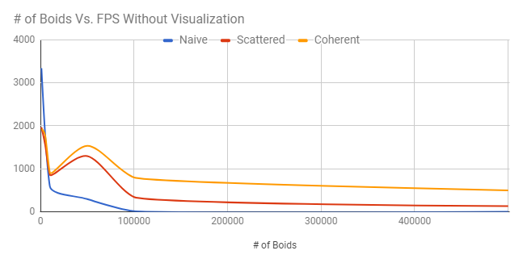
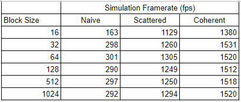
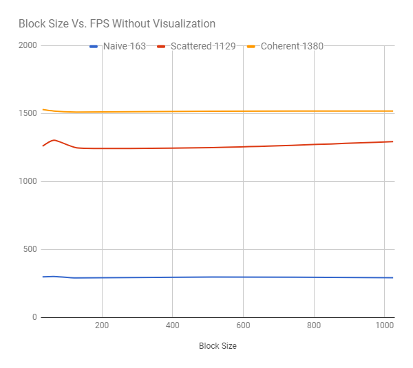

**University of Pennsylvania, CIS 565: GPU Programming and Architecture,
Project 1 - Flocking**

* Charles Wang
* Tested on: Windows 10, i7-6700K @ 4.00GHz 16GB, GTX 1060 6GB (Personal Computer)

**Project Overview and Goals**

In this project, my goal was to apply (newly acquired) fundamental concepts in CUDA to create a simulation where boids follow simple flocking rules. In this project, I've implemented three different neighbor searching techniques: 
 
 * Naive: Every frame, each boid checks every other boid
 * Scattered Grid: Every frame, store the boids' positions in a uniform grid structure and each boid only checks boids in neighboring grid cells
 * Coherent Grid: Same as the Scattered Grid method except the array of boid positions and velocities are rearranged to remove extraneous pointer access
 
 A more in-depth explanation can be found in Instructions.md

**Results**

The following chart and graphs show how increasing the number of boids in the simulation affects the framerate (all measurements taken on the hardware described at the top)

The following chart and graph show how increasing the block size affects the framerate of the simulation

**Conclusion and Evaluation**

For all the implementations, the framerate decreases as the number of boids in the simulation increases. It's obvious that the simulation slows down because at each iteration, there are more iterations to complete. However, it's interesting how both the Scattered Grid and Coherent Grid simulations increase in framerate between 5,000 and 10,000 boids. This may have to do with the number of boids vs number of grid cells. My implementation uses a grid resolution of 22, meaning that there are 10,648. Perhaps reaching a closer value allows the overhead to benefit the runtime more.

Increasing the block size increased the framerate until the block size reached 32. Perhaps this has to do with the number of threads in a warp (32) or certain hardware specifications of my GPU. Maybe running a certain number of threads per block limits the amount of local memory to use, thus capping performance.

The Coherent Grid method showed a significant improvement over the Scattered Grid method, especially for simulations with a large number of boids. I didn't initially think there would be such a difference, because I wasn't aware the magnitude of difference between shared memory access vs local access. 

Given that my fixed neighbor distance was always equal to or less than half the uniform grid cell width, checking 27 neighboring grid cells instead of 8 negatively affected both uniform grid implementations. Knowing that influencing boids will never be found in certain grid cells means that we can limit neighbor search to 8 grid cells without loss of information.