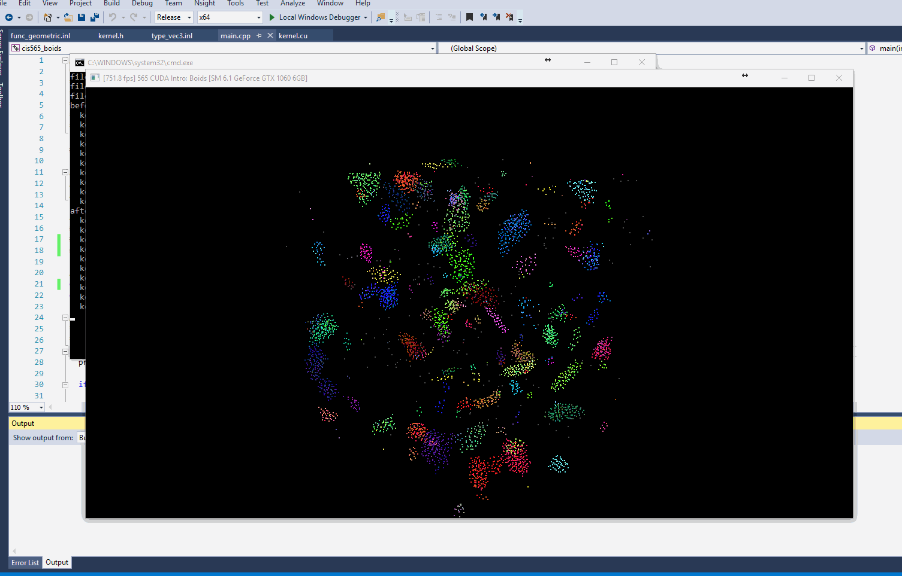
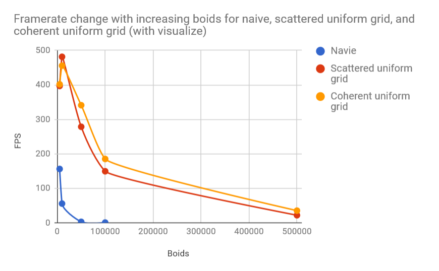

**University of Pennsylvania, CIS 565: GPU Programming and Architecture,
Project 1 - Flocking**

* LINSHEN XIAO
* Tested on: Windows 10, Intel(R) Core(TM) i7-6700HQ CPU @ 2.60GHz, 16.0GB, NVIDIA GeForce GTX 970M (Personal computer)

### Screenshot

A screenshot of the boids:

### Performance analysis

Framerate change with increasing # of boids for naive, scattered uniform grid, and coherent uniform grid (with and without visualization)

Boids | Navie | Scattered uniform grid | Coherent uniform grid
:---|:---:|:---:|:---:
5000 | 156.2 | 397 | 401.8
10000 | 55.7 | 481.6 | 455.9
50000 | 2.8 | 278.6 | 341.1
100000 | 0.7 | 149.5 | 185.2
500000 | ? | 21.9 | 35.3

Framerate change with increasing block size

### Questions

For each implementation, how does changing the number of boids affect performance? Why do you think this is?

As the number of boids grows, the FPS will decrease, that's because more data needs too be computed if the number of boids increase.

For each implementation, how does changing the block count and block size affect performance? Why do you think this is?

The change of block count and block size does not affect the performance dratmactically.

For the coherent uniform grid: did you experience any performance improvements with the more coherent uniform grid? Was this the outcome you expected? Why or why not?

Did changing cell width and checking 27 vs 8 neighboring cells affect performance? Why or why not?
