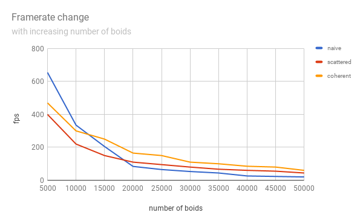
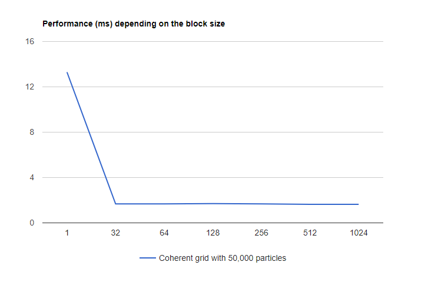

**University of Pennsylvania, CIS 565: GPU Programming and Architecture,
Project 1 - Flocking**

* Yalun Hu
* Tested on: Windows 10, i7-6700HQ CPU @ 2.60GHz 32GB, GTX 1070 8192MB (Personal computer)

### (TODO: Your README)

Include screenshots, analysis, etc. (Remember, this is public, so don't put
anything here that you don't want to share with the world.)

  

