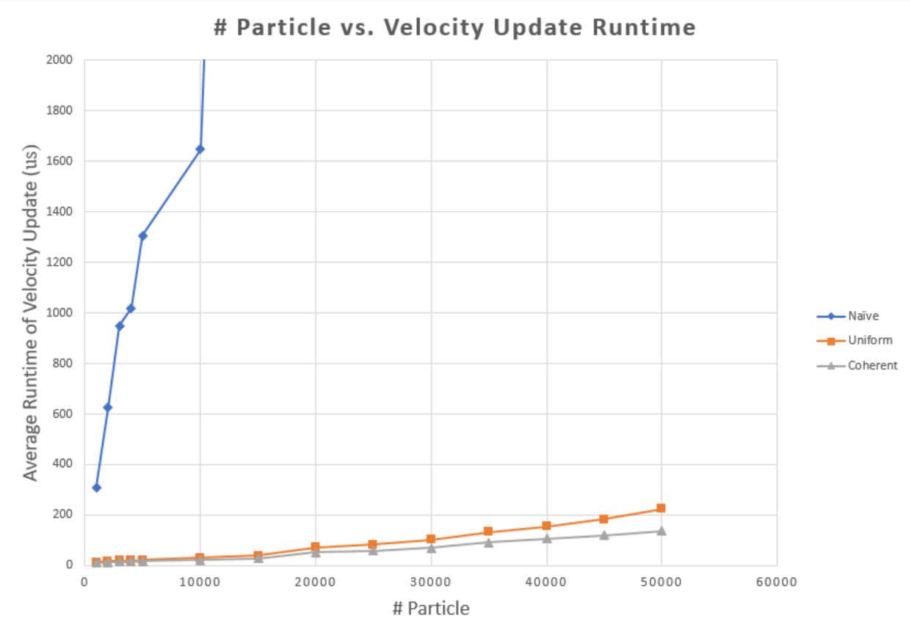
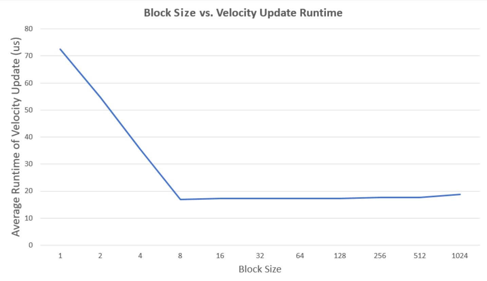

# University of Pennsylvania, CIS 565: GPU Programming and Architecture, Project 1 - Flocking

* Qiaoyu Zhang
* Tested on:
  * Windows 10, i7-6700 @ 3.40GHz 64GB, GTX 1070 8192MB (Personal Desktop)
  * Ubuntu 16.04, i7-6700HQ @ 3.50GHz 16GB, GTX 1060 6144MB (Personal Laptop)

## Summary

This project implements a flocking simulation based on the [Reynolds Boids algorithm](http://www.red3d.com/cwr/boids/) on a GPU using CUDA and OpenGL, along with two levels of optimization: a univorm grid, and a uniform grid with semi-coherent memory access.

## Result
Below is a sample output of uniform grid with semi-coherent memory access simulating 10000 boids. (The screenshot is taken on personal laptop.)

## Performance Analysis
Performance is measured by average frames per second (fps) at different number of particles and block size.

### Number of Particles
Tests were done using a block size of 128. CUDA profiler was used to time the runtime of each function call. The average runtime of velocity update is used to measure the performance.

We can see that uniform grids greatly improves the performance and semi-coherent memory access helps increase the performance even more. This is because uniform grid significantly reduces the number of boids that need to be checked. Coherence makes memory access much faster. 

### Block Size
Tests were performed using 5000 boids with coherent memory access. Measurement methods are the same as above.

Note that when the block size is 32 or less, there is only one warp in a block. These smaller blocks means that larger number of blocks are needed. With every warp in its own block, the benefit of shared memory is lost.

We can see the performance is increasing as the block size grow from 1 to 32, but start slightly decreasing when the block size is increasing from 32 to 1024.