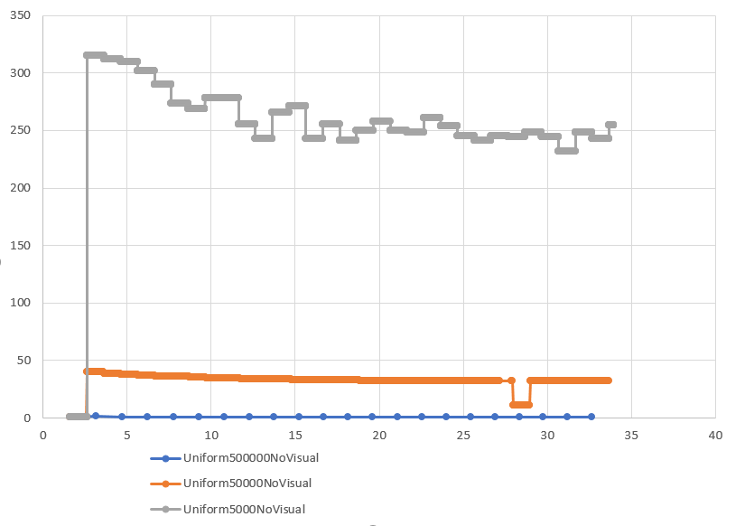

**University of Pennsylvania, CIS 565: GPU Programming and Architecture,
Project 1 - Flocking**

* Yuxin Hu
* Tested on: Windows 10, i7-6700HQ @ 2.60GHz 8GB, GTX 960M 4096MB (Personal Laptop)

### README
#### Results

                             Naive Simulation 5000Particles 27 NeighborSearch

                             UniformSimulation 5000Particles 27 NeighborSearch

                             CoherentSimulation 5000Particles 27NeighborSearch

                             CoherentSimulation 50000Particles 27NeighborSearch

                             CoherentSimulation 500000Particles 27NeighborSearch

#### Performance Analysis
1. Performance Comparason between 3 simulation methods

3 Simulations Performance Comparason With Visual

3 Simulations Performance Comparason Without Visual

Uniform Grids and Coherent Grids Search performs significantly better than Naive Simulation, because the previous two simulations reduce the number of boids need to be checked drastically. The coherent grid search performs a little bit better than uniform grid search without Visual. With Visual simulation they two perform almost the same. Coherent grid is supposed to perform a little bit better because it reduces one level of data retrieval from global memory, although the cost is we need extra space to store the shuffled data.

2. Performance Analysis as boids number increases.

Naive Simulation With Visual

Naive Simulation Without Visual

Uniform Simulation With Visual

Uniform Simulation Without Visual

Coherent Simulation With Visual

Coherent Simulation Without Visual

From the plots we can observe that as the boids number increases, the performance drops, with and without visual, in all three simulations. Different simulation has different limit on how many boids can simulate. Clearly coherent can support most number of boids.

3. Performance Analysis as block size changes.

Coherent Simulation with 50000 Boid Particles, with visual

From the tests I did, I observed that as the block size decreases, the performance improves.

4. Other Observations.

Coherent Simulation 50000 Boids With Visual Neighbor Search Comparason

Coherent Simulation 50000 Boids With Visual Neighbor Search Comparason After Improvement

The first plot is a comparason between the same simulation using different neighbor search. One searches 8 neighbor cells with each cell width 2 times the distance. The other searches 27 neighbor cells with each cell width the same as the distance. In this implementation, when I calculated the gridCellStartIndices and gridCellEndIndices in kernal function kernIdentifyCellStartEnd, I did not use a parallel unlooping methos. I simply loop over the particleGridIndices array, and check if there is an index identical to the current cell Index. Although there is some optimization to prevent it from going through all particleGridIndices, but the worst case is still O(n), where n is number of boids, and I did this for all grid cells. As the total number of cells increase, this brute force search will significally drag down the performance. After I improved this method, the complexity for kernIdentifyCellStartEnd becomes O(1). When searching over neighboring 27 grid cells, the total volume is 27*distance^3, which is smaller than volume 8*8*distance^3, therefore the total number of boids need to be checked actually decreases. The performance comparason in second plot above shows the opposite effect after this improvement.

#### Answers to Questions
Q: For each implementation, how does changing the number of boids affect performance? Why do you think this is?

A: Increasing number of boids slows down the performance. I think because the number of data retrieval from global memory increases as boids number increases. For naive simulation, the number of neighboring boids it need to go through increases. For uniform and coherent grid simulations, the number of threads increases, and GPU needs to schedule more threads to run.

Q: For each implementation, how does changing the block count and block size affect performance? Why do you think this is?

A: It seems that reducing block size / increasing block count improves performance. My guess is that having multiple smaller size blocks will optimize the register memory usage within each block, as a block with too many threads will not have enough register memory.

Q: For the coherent uniform grid: did you experience any performance improvements with the more coherent uniform grid? Was this the outcome you expected? Why or why not?

A: Yes I expeted coherent uniform grid should performs better. However in my testing, with visual, coherent performs not much better than uniform grid. Without visual display, coherent performs slightly better than uniform grid. I think although the coherent grid reduces one level of the global memory data retreival, it requires two shuffle process and two additional array memory on GPU, therefore the tradoff makes the performance improvement not so obvious.

Q: Did changing cell width and checking 27 vs 8 neighboring cells affect performance? Why or why not?

A: As discussed in Performance Analysis Secion, part 4 above, it does affect the performance. As the volume occupancy of 27 grid is 27*distance^3, and volume occupancy of 8 grid is 64*distance^3, the number of boids encompassed in smaller volume is also fewer, therefore there are fewer neighboring boids we are checking in 27 neighbor.