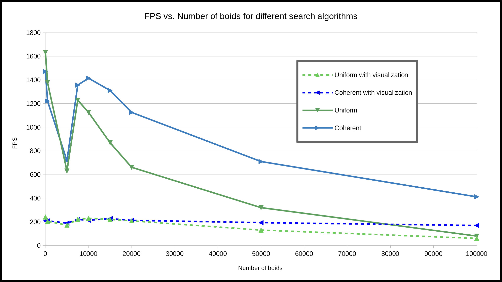
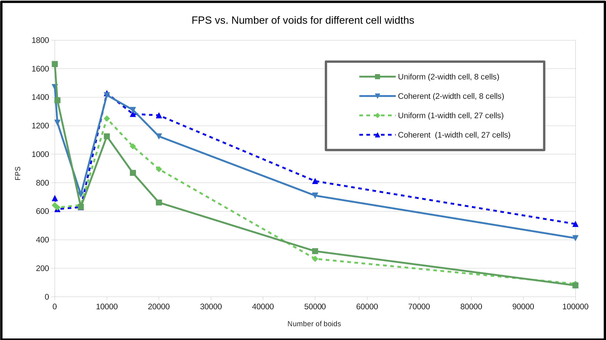

**University of Pennsylvania, CIS 565: GPU Programming and Architecture,
Project 1 - Flocking**

* Mauricio Mutai
* Tested on: Windows 10, i7-7700HQ @ 2.80GHz 16GB, GTX 1050Ti 4GB (Personal Computer)

|  |  |  |
|:-------------------------------:|:--------------------------------:|:--------------------------:|
| 50,000 boids                    | 100,000 boids                    | 500,000 boids
### Overview

#### Introduction

The main aim of this project was to get myself acquaintanced with CUDA programming. After learning some basic CUDA concepts in class, I implemented this boid simulation in order to leverage the parallel computing capabilities of a GPU.

Three different search algorithms (naive, uniform grid, coherent grid) were implemented in order to investigate which provided the best performance for the simulation. In addition, smaller tweaks to these algorithms, such as CUDA block size, were tested as well.

Below are images of the final working project. More specifically, it is running the coherent grid search with 10000 boids, block size of 128, and cell width of two neighor distances.

#### Screenshot of boid simulation in progress

#### Animation of boid simulation in progress

### Performance Analysis

#### Methodology

I measured the performance of the simulation by using the frames per second (FPS) metric displayed on the window's title. I found that it fluctuated too much to give consistent readings, so I added the average of the last 10 FPS measurements to the window title as well.

When measuring FPS, I tried to keep the running environment as consistent as possible. For example, I noticed that having Chrome open directly under the running simulation led to significantly lower framerates than when Visual Studio was open in that position. Thus, I always measured with Visual Studio open, and waited at least 10 seconds for each measurement in order to have a more stable and consistent FPS reading.

Unless otherwise specified, the parameters used were as follows:

* number of boids = 10000
* block size = 128
* cell width = 2 * neighborhood distance

Below, I examine the effect of several parameters of the simulation on its performance.

#### Number of boids

Below is a graph showing how FPS changes for the various search algorithms as the number of boids increases. For brevity, I will use "N" to refer to the number of boids in the simulation.

We can see the naive search starts off with the best performance for very small N. However, its performance drops drastically as N increases, such that, for more than 5000 boids, the naive solution is clearly inferior to the grid-based algorithms.

The better relative performance for small N can be explained by the low overhead of the naive algorithm. Since it requires less data to be copied and sorted, it saves time relative to the grid-based solutions. As N increases, searching the entire grid becomes more and more costly, such that the optimizations in the grid-based searches start making up for their overhead, and eventually they overtake the naive search's performance.

The uniform and coherent grid search algorithms have similar performance for N <= 5000, which suggests the memory optimizations of the coherent grid do not make a significant impact for sufficiently low N. As N increases, we generally see a decrease in performance, which is what we would expect, since each step of the simulation requires more neighbor boids to be checked, even with the grid optimizations. In addition, more boids need to be sorted and updated at each step.

Curiously, from N = 5000 to N = 7500, there is an increase in FPS for both grid-based solutions. This increase is not observed in the naive solution, which suggests it is caused by the grid-based search. I am not sure what is causing this local increase, since the expected number of neighbors each boid has to search for should increase along with N. One hypothesis I have is that using N = 5000 boids forced the GPU to use/allocate its memory in an inefficient way, whereas N = 7500 and N = 10000 lead to buffers that are allocated in more efficient and convenient locations in memory, allowing for quicker access. After this increase in performance, the expected downward trend returns for increasing N.

The graph above also includes data for the simulation's performance when visualization is enabled. For the grid-based solutions, we notice that the rendering of the boids becomes the bottleneck, since the framerate is significantly lower than when visualization is disabled, and remains roughly constant even as N increases. Interestingly, this does not occur for the naive case, where the simulation itself is the bottleneck. This can be inferred from the fact that the performance with and without visualization is almost the same for N >= 10000.

#### Block size

Below is a graph showing how FPS changes for the various search algorithms as the block size increases. The block count is automatically adjusted in the code as the block size changes: `dim3 fullBlocksPerGrid((N + blockSize - 1) / blockSize);`.

For all search algorithms, we can notice a steady improvement in performance as the block size increases, but only up to 32. After that performance either drops slightly or remains constant, except for the coherent grid search, which hits a maximum at a block size of 128 instead.

The likely reason for this behavior is that each warp that is dispatched to the GPU contains 32 threads. Thus, for block sizes smaller than 32, each warp is not being used in the most efficient way, since the warps would not be filled to their maximum capacity. For larger block sizes, there does not seem to be any gains for the naive and uniform grid algorithms. I am not sure why performance improves for the coherent grid at a block size of 128, but it is likely due to this being an optimal number where there are enough blocks (and thus, warps) to "hide" costly operations such as large memory reads (which are easier to hide due to the coherent memory access), but not so many so that the overhead of scheduling warps starts to outweight those positive effects.

Here, we see that the rendering of boids acts as a bottleneck when running the simulation with visualization enabled. This time, this is true for all algorithms. The cost of rendering is also reduced by increasing block size, but only up to 32.

#### Coherent grid

Below is a graph showing how FPS changes for the uniform and coherent grid approaches as the number of boids increases. This is the same graph as in the "Number of boids" section, but with the data from the naive algorithm removed.

Here, we can see in more detail that the coherent grid is actually outperformed by the simpler uniform grid for N <= 5000. This is probably due to the increased overhead of the coherent grid method, which requires the re-shuffling of the boid data, out-weighing the benefits of the more coherent memory access. After all, for smaller N, there is a larger chance that a group of boids examined by the uniform grid method happen to be close to each other in memory even without the re-shuffle.

For N >= 7500, the coherent grid method starts to clearly outperform the uniform grid method. This suggests the overhead of re-shuffling the boid data quickly becomes negligible when compared to the delays caused by the scattered memory access in the uniform grid method, which becomes more and more likely as N increases. We can see that the difference is so drastic that it can even be seen when visualization is enabled. Although the rendering process continues to be a bottleneck is either case, the difference in the performance of the actual simulation is enough to cause a noticeable gap between the framerates with visualization enabled.

This is the outcome I expected. Prior to running the measurements, I theorized that the additional overhead of the coherent grid would hurt it for relaitvely small N, but the coherent grid would scale much better for larger N. My reasons for believing so are the same ones I used above to explain the recorded behavior of each algorithm.

In addition, the coherent grid implementation has three nested loops where the coordinates are iterated in the following order, from outermost to innermost: z, y, x. This allows this implementation to make best use of the coherent memory access. The uniform grid uses the more obvious x, y, z order.

#### Cell width

Below is a graph showing how FPS changes for the grid-based approaches as the number of boids increases. This is graph shows two versions of each algorithm: one where the grid cells have a width of one neighborhood distance (so at most 27 cells are checked per boid), while the other has grid cells with double that width (at most 8 cells are checked per boid). The measurements were taken with visualization disabled.

First off, let us consider the high-level differences between the 1-width and 2-width versions of each algorithm. Basically, the 2-width version checks fewer cells at each step (8 per boid vs. 27 per boid). However, the 2-width version, in the worst case, checks a 4x4x4 cube, while the 1-width checks a 3x3x3 cube. Thus, for each boid, the 2-width version is expected to check a larger volume, and thus, more boids.

With that in mind, we can move on with the analysis. For N <= 500, the 1-width versions are clearly inferior. This is likely due to the additional overhead of having to check 27 cells instead of just 8 (e.g. this requires more jumps, which can be mispredicted by the GPU and cause stalls). The benefit of checking a potentially smaller number of boids is not significant here, since the boids are spread very sparsely anyway.

For N = 5000, the difference in performance between the 1-width and 2-width versions decreases drastically. At this point, the benefits from having to check a smaller number of boids starts to become more significant and make the 1-width versions scale better locally.

For the uniform grid method, we can notice that the 1-width version begins to outperform the 2-width version at N = 10000. However, for larger N (say, N = 100000), their framerates start converging. This is likely because other costly operations, such as scattered memory accesses, start bottlenecking the performance, reducing the effect of the cell width.

As for the coherent grid method, the 1-width and 2-width versions have comparable performances for N = 10000 and N = 15000. For N >= 20000, the 1-width has noticeably better performance, and it remains better up through N = 100000. This is likely because the coherent grid does not run into the same bottleneck as the uniform grid, so the 1-width versions keeps benefitting from the reduced number of boids checked at each step.

### Miscellanous Details

`USE_SINGLE_WIDTH_CELL` in `kernel.cu` changes whether the grid-based algorithms use 1-width or 2-width cells. If set to 0, they use 2-width cells; otherwise, they use 1-width cells.

I doubled the resolution and size of my boids when measuring FPS. For the GIFs included here, I opted to revert back to the original resolution to get better framerates on the GIFs.

The three GIFs at the top were rendered with coherent grid, block size = 128 and 1-width cells. The 500k simulation managed to bring performance down to 60 FPS.