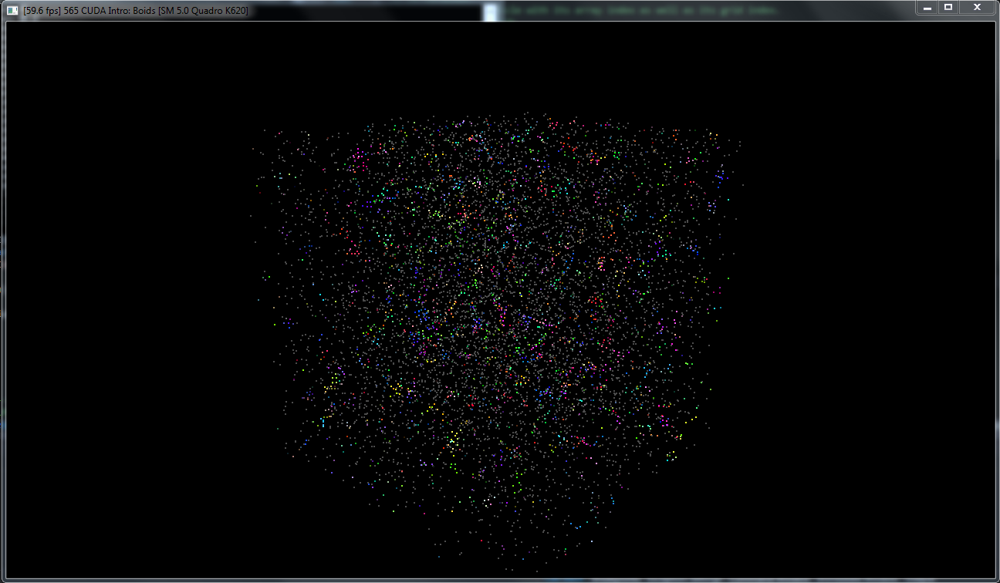
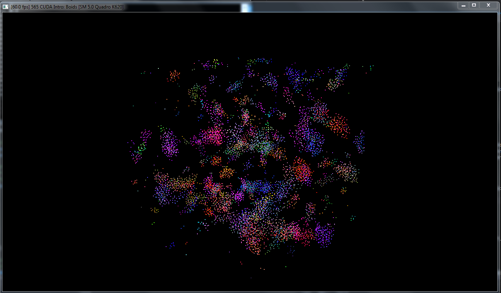
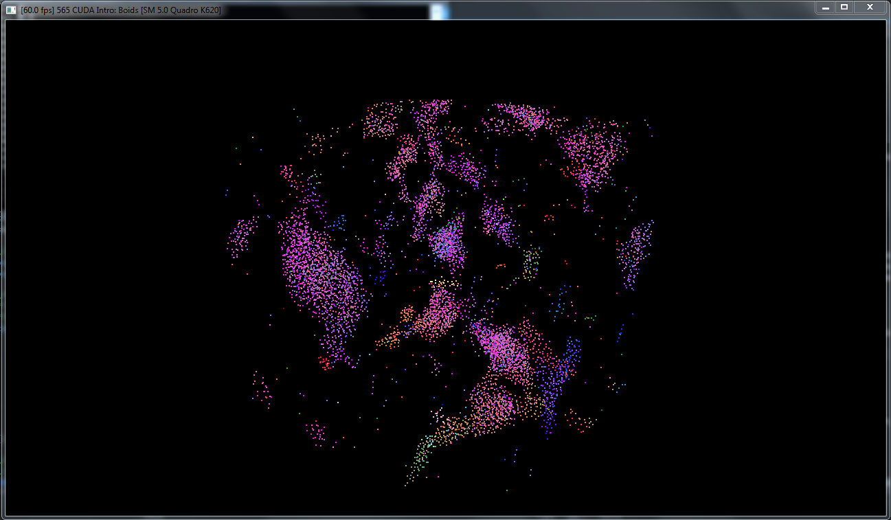

**University of Pennsylvania, CIS 565: GPU Programming and Architecture,
Project 1 - Flocking**

* William Ho
* Tested On: Windows 7 Professional, i7-6700 @ 3.40 GHz 16.0GB, NVIDIA QuadroK620 (Moore 100C Lab)

Include screenshots, analysis, etc. (Remember, this is public, so don't put
anything here that you don't want to share with the world.)

