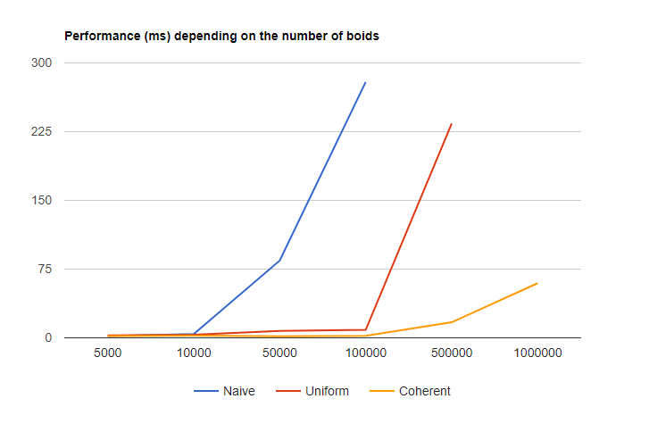
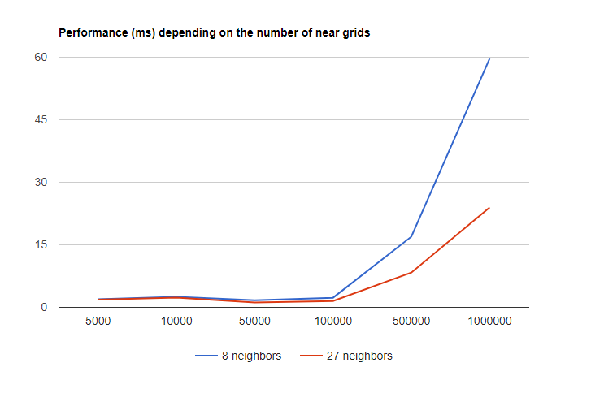

**University of Pennsylvania, CIS 565: GPU Programming and Architecture,
Project 1 - Flocking**

* Byumjin Kim
* Tested on: Windows 10, i7-6700HQ @ 2.60GHz 15.89GB (Personal labtop)

### Result

The speed of each boid is effected by the power condition (battery status of labtop) of the machine because this project doesn't use real-time interval for updating its position.

### Performance Analysis

* GPU Spec:
	- Name:                          GeForce GTX 1060
	- Revision:                      6.1
	- Total global memory:           6442450944
	- Total shared memory per block: 49152
	- Total registers per block:     65536
	- Warp size:                     32
	- Max threads per multiprocessor:2048
	- Max grid dimensions:           [2147483647, 65535, 65535]
	- Max threads per block:         1024
	- Max registers per block:       65536
	- Max thread dimensions:         [1024, 1024, 64]
	- Clock rate:                    1569000
	- Total constant memory:         65536
	- Texture alignment:             512
	- Number of multiprocessors:     10

## Performance (ms) depending on the number of boids

| # of Boids    | 5,000      | 10,000       | 50,000       | 100,000      | 500,000      | 1000,000    |
| ------------- | :--------- | :----------: | :----------: | :----------: | :----------: | ----------: |
| Naïve         | 2.00       | 4.20         | 84.34        | 279.18       | crash        | crash       |
| Uniform Grid  | 2.59       | 3.46         | 7.52         | 8.7          | 233.92       | 1057.18     |
| Coherent Grid | 1.93       | 2.54         | 1.70         | 2.31         | 16.95        | 59.67       |

When the number of boids is increasing, the performance is more expensive. Because, it also makes increase the number of neighbor boids which should be iterated, a thread should iterate more code lines to calculate for its flocking algorithm. And, there is a huge improvement on using Coherent grid instead of using just Uniform Grid. I didn't expect this because the difference is only decreasing one step of searching process, which is finding an element in an unsorted array. It seems that using array elements in GPU side is really critical for its performance.

The interesting point is, in Coherent Grid, the performance of using 10,000 boids is more expensive than those of 50,000.
It might be caused by GPU memory structure.

## Performance (ms) depending on the block size

| Block Size    | 1      | 32     | 64     | 128    | 256    | 512    | 1024   | 2048   |
| ------------- | :----- | :----: | :----: | :----: | :----: | :----: | :----: | -----: |
| Coherent Grid | 13.30  | 1.67   | 1.68   | 1.7    | 1.68   | 1.64   | 1.64   | crash  |

As expected, using mutiple blocks gives better performance instead of using just one block.
But, from certain block size (32 blocks), it is hard to see the difference because GPU has also limited number of threads for calculations.

## Performance (ms) depending on the number of near grids

| # of Boids    | 5,000      | 10,000       | 50,000       | 100,000      | 500,000      | 1000,000    |
| ------------- | :--------- | :----------: | :----------: | :----------: | :----------: | ----------: |
| 8             | 1.93       | 2.54         | 1.70         | 2.31         | 16.95        | 59.67       |
| 27            | 1.85       | 2.35         | 1.16         | 1.50         | 8.33         | 23.98       |

Using 27 neighboring cell (changing cell width) gives better performance, if it uses higher number of boids.
This is because, even if the 27 case iterates more neighbor grid cells than those of the 8 case, the number of neighbor boids which should be interated per each boid is
less. 27 neighboring cell's searching range is 3 times of rule's distance. But, 8 neighboring cell's searching range is 4 times of rule's distance. Thus, if scene_scale value is
same with each case, the case of 27 neighboring cell is cheaper.