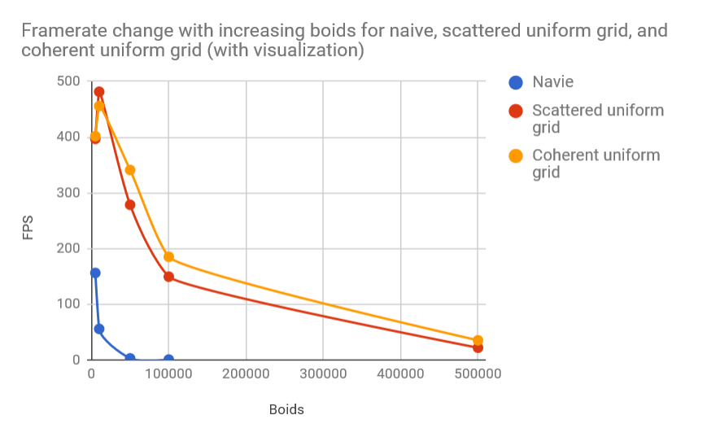
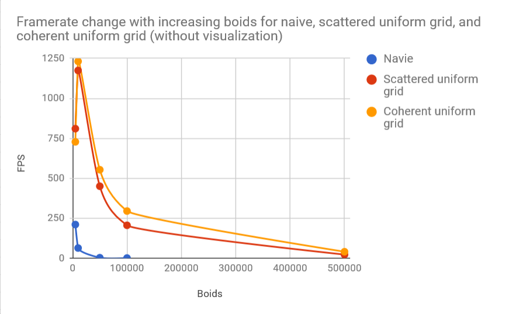
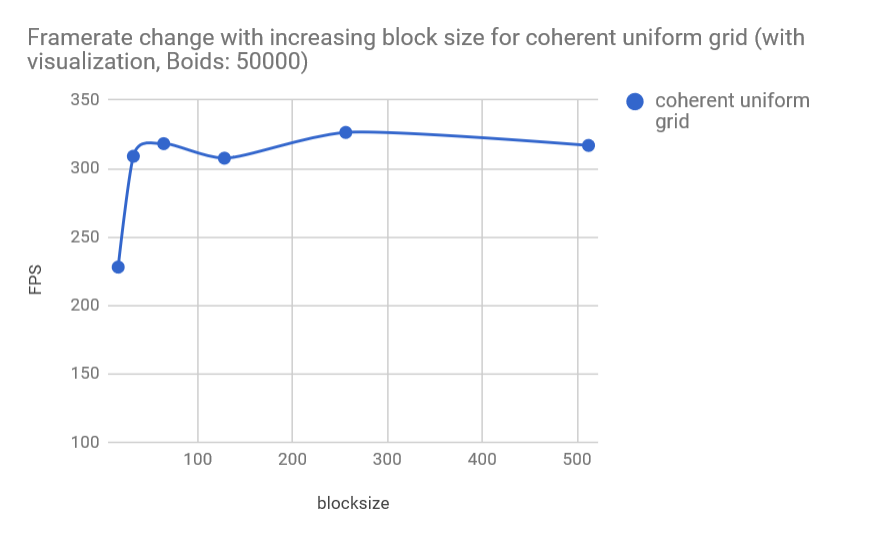
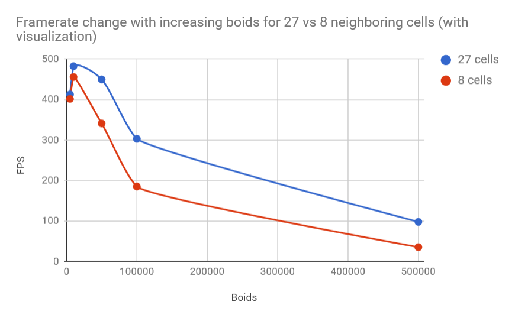

**University of Pennsylvania, CIS 565: GPU Programming and Architecture,
Project 1 - Flocking**

* LINSHEN XIAO
* Tested on: Windows 10, Intel(R) Core(TM) i7-6700HQ CPU @ 2.60GHz, 16.0GB, NVIDIA GeForce GTX 970M (Personal computer)

## Screenshot

A screenshot of the boids:

## Performance analysis

* Framerate change with increasing # of boids for naive, scattered uniform grid, and coherent uniform grid (with and without visualization)

Boids | Navie | Scattered uniform grid | Coherent uniform grid
:---|:---:|:---:|:---:
5000 | 156.2 | 397 | 401.8
10000 | 55.7 | 481.6 | 455.9
50000 | 2.8 | 278.6 | 341.1
100000 | 0.7 | 149.5 | 185.2
500000 | ? | 21.9 | 35.3

Boids | Navie | Scattered uniform grid | Coherent uniform grid
:---|:---:|:---:|:---:
5000 | 210.5 | 810.4 | 728.0
10000 | 63.4 | 1174.7 | 1231.8
50000 | 2.8 | 450.2 | 553.4
100000 | 0.7 | 205.6 | 294.9
500000 | ? | 22.3| 40.2

As the number of boids grows, the FPS may always decrease(with some small exception), that's because more data needs to be computed if the number of boids increase.

Improvement: Coherent uniform grid > Scattered uniform grid > Naive

Framerate change with increasing block size

Blocksize | Coherent uniform grid
:---|:---:
16 | 228
32 | 309
64 | 318.2
128 | 307.6
256 | 326.4
512 | 316.9

The change of block size does not affect the performance dramatically, but we can still see that block size 32 is still better than block size 16.

## Questions

* For each implementation, how does changing the number of boids affect performance? Why do you think this is?

⋅⋅⋅As the number of boids grows, the FPS will decrease, that's because more data needs to be computed if the number of boids increase.

* For each implementation, how does changing the block count and block size affect performance? Why do you think this is?

⋅⋅⋅The change of block count and block size does not affect the performance dramatically, but it has some improvement before 32.

* For the coherent uniform grid: did you experience any performance improvements with the more coherent uniform grid? Was this the outcome you expected? Why or why not?

⋅⋅⋅Yes. We can see the great improvement when the number of boids > 50000. Coherent uniform grid sort the array to skip a searching step to improve the performance.

* Did changing cell width and checking 27 vs 8 neighboring cells affect performance? Why or why not?

⋅⋅⋅Yes. 

Boids | 27 Cells | 8 Cells
:---|:---:|:---:
5000 | 412.8 | 401.8
10000 | 482.6 | 455.9
50000 | 450 | 341.1
100000 | 303.2 | 185.2
500000 | 97.8 | 35.3

⋅⋅⋅Yes. When the boids' amount is huge, though 27 cells needs to iterates more neighbors, the number of boids needs to be interated is less, so a large amount of time of computing distance is saved.