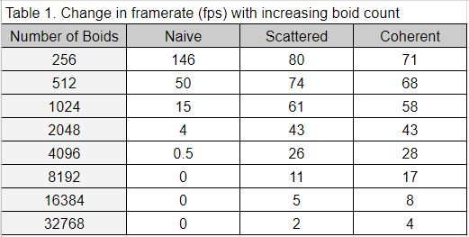
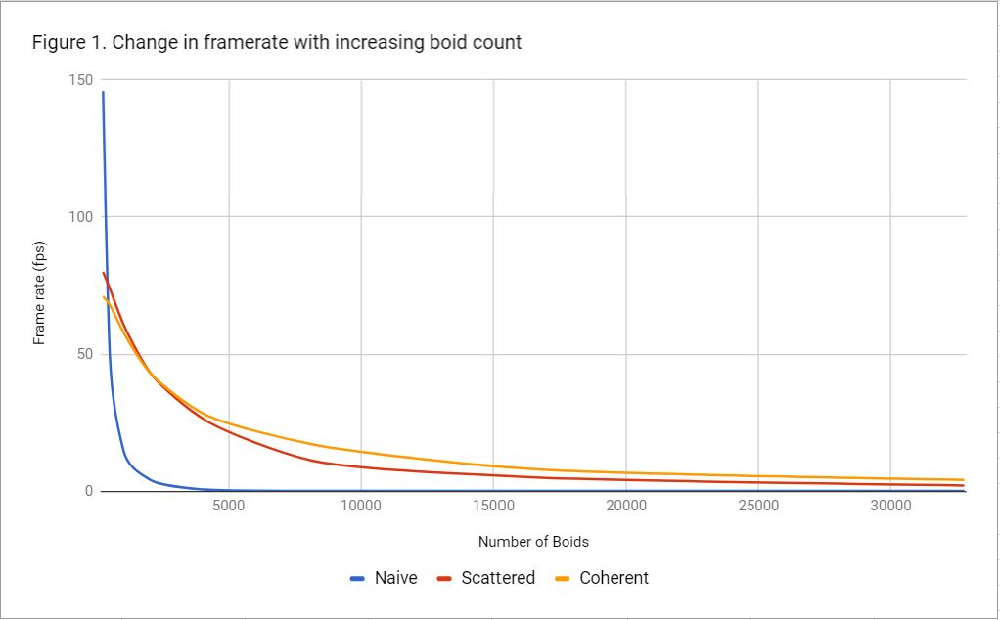
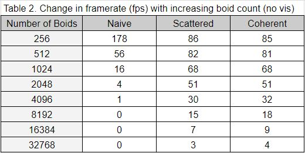
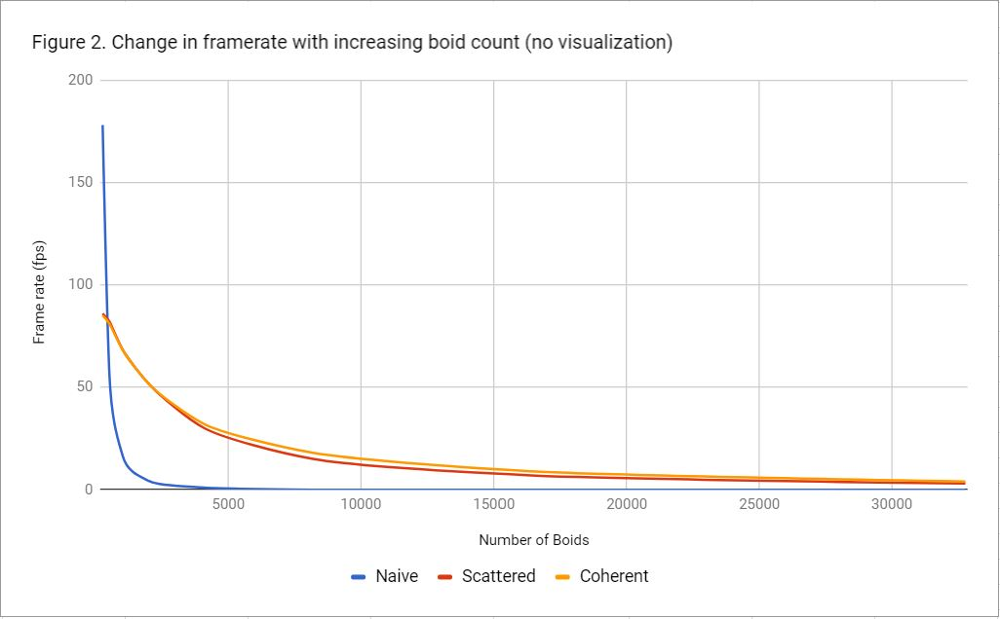
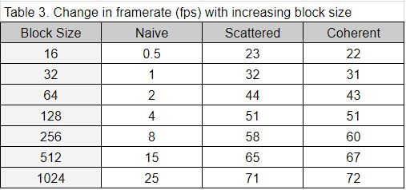
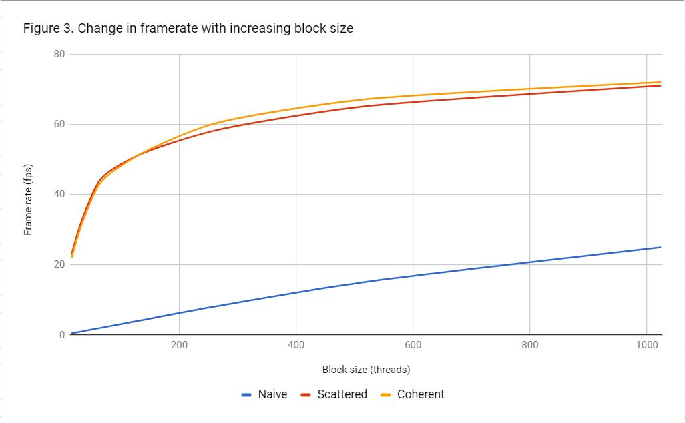

**University of Pennsylvania, CIS 565: GPU Programming and Architecture,
Project 1 - Flocking**

* Mohamad Moneimne
* Tested on: Windows 10, i7-4700HQ @ 2.40GHz 8GB, GT 750M 2019MB (Personal Laptop)

### Overview

###### (Run on GT750M with 8192 boids)

This project was a basic introduction to CUDA kernels, how to use them, and how to analyze their performance. This was done by implementing the Reynolds Boids algorithm in parallel on the GPU. 

The project uses three main algorithms to accomplish this. We first do a naive algorithm such that each boid checks for velocity contributions from every other boid in the simulation. This is naive because we do _O(N^2)_ work over the simulation of one frame. 

To remedy this, we introduce a uniform grid structure that pools the boids into groups based on twice the neighborhood distance. This way, we only need to check for neighboring boids within a maximum of 8 cells, culling any boids that are outside of this region. By sorting the boid indices into their corresponding grid cells, we achieve much faster speeds. However, the position and velocity data is still in the original _scattered_ order as given before sorting, which leads to an added layer of indirection before finding out what data corresponds to which boid. 

In an attempt to make this even faster, we try to make the position and velocity buffers _coherent_ in memory with respect to the newly ordered grid cells, too. By sorting the velocity and position data into this order, we are capitalizing on the fact that the cache will load in portions of the rest of the boid data within the grid.

### Performance Analysis

#### Effect of boid count on framerate

We can compare how the performance of these three approaches compare by looking at the change in frame rate of the simulation as the number of boids increase.

As shown in the results above, we get what we expect. As the number of boids increase, all of the approaches begin to slow down. However, it can be seen that the naive algorithm performs better than the scattered and coherent approaches with fewer boids. This is because with fewer boids, comparing all the boids against each other is actually faster than the overhead caused by setting up the grid and sorting in the other approaches. However, this changes quickly as we see the naive algorithm's performance drop exponentially with the increasing number of boids.

Another interesting result is that sorting the velocity and position such that they are spatially coherent in memory is not that much faster that scattered lookups. This is likely because we are only making the memory coherent for the boids within a single grid cell. As the number of boids increase, there is a slight improvement in the performance of the coherent approach due to higher densities within each grid cell.

These observations don't change much when we turn off the visualization of the simulation.

As can be seen, we gain a few frames per second pretty consistently. This is likely due to the fact that we don't have to take the time to render the points to the screen as well.

#### Effect of block size on framerate

We can also determine the effect of block size chosen on the framerate of the simulation. When testing this, 2048 boids were simulated without visualization.

Trying to understand these results are likely specific to the architecture or the used GPU, so I will try to take this into accound in my explanation. The compute capability of my GPU (GT750M) is 3.0.

**Grid dimensions**: For my GPU, I have a maximum of _2^(31) - 1_ blocks per grid in the x-dimension. Therefore, we likely don't ever hit a bottle neck in the number of blocks we can launch given that even at 16 threads per block, we only need 128 blocks.

**Blocks per SM**: The GT750M can handle up to 16 blocks per multiprocessor. This means that, in the case of using 16 threads per block, we can only hold 16 of the 128 blocks in a single SM at a time.The GT750M also only has 2 multiprocessors, which means that 32 of the 128 blocks can be run at a time. This means that the GPU has to wait before it can load the rest of the blocks in, leading to a slower simulation. Once we raise the number of threads per block to 64, we create 32 blocks out of the 2048 boid threads. This allows us to launch all the threads at once on the GPU. This makes sense with our scattered and coherent results since there is a sharp framerate increase from a block size of 16 until 64, after which the increase begins to taper off.

**Registers per block**: The GT750M has a maximum of 65536 registers per block. This might explain why the rate at which our framerate increases starts to fall off after hitting 64 threads per block. As we add more threads per block, we are expecting each block to handle more memory since we are adding more boid states to handle. This means that at 1024 threads per block, each boid only has 64 registers to use. If we exceed this, data in registers likely need to be moved to and from global memory, leading to an additional overhead in memory management.

**Threads per SM**: The GT750M also only handles up to 2048 threads per SM. Considering the maximum number of threads per block we can use is 1024 and we only have 2048 boids in our simulation, we can easily run the simulation with two blocks in a single multiprocessor. This means that as the number of threads per block increases to 1024, the simulation speed will increase but not take a penalty from here.

If anyone reaches this far and happens to see any issues with my analysis or something I missed, please feel free to submit an issue and let me know!