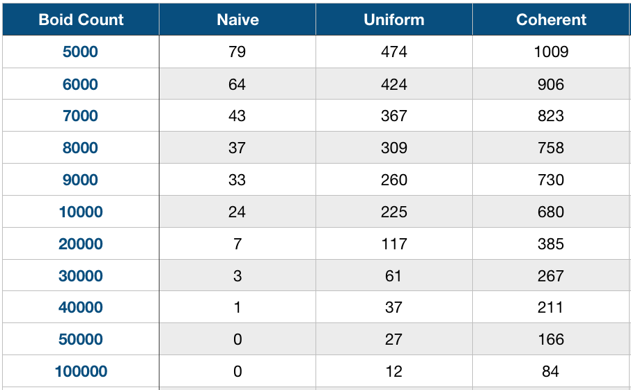
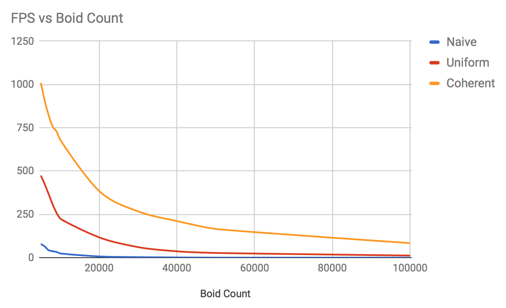
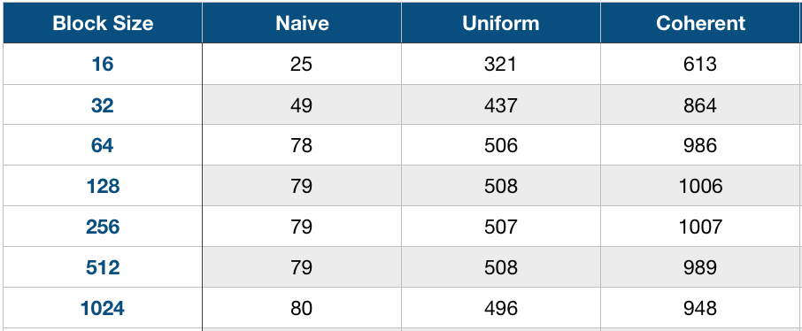
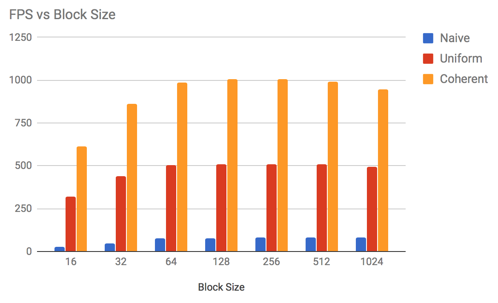

**University of Pennsylvania, CIS 565: GPU Programming and Architecture,
Project 1 - Flocking**

* Mohamed Soudy
* Tested on: Windows 10 Enterprise, i7 @ 2.7 GHz 16GB, GT 650M 1024 MB

### Result

### Performance Analysis

### Frames per second vs number of boids

Looking at the graph above, the difference in frame rate between the naive, uniform and coherent implementations
is quite drastic. The coherent grid is way faster than both the naive and uniform implementations. It is faster than the uniform implementation because instead of retrieving the boid index for every neighbor they are accessed directly. 

Increasing the number of boids in all implementations does in fact affect performance. However, with the coherent grid, the system can handle more than 100000 boids, whilst the FPS of the other implementations drop below 10.

### Frames per second vs block size

Initially, varying the block size improves performance. However, increasing the block size above 32 stops affecting performance which may be because the warp size is 32. 