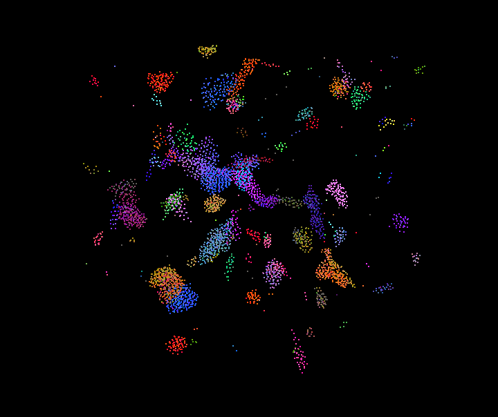
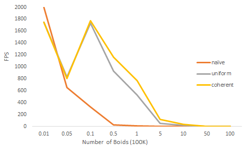
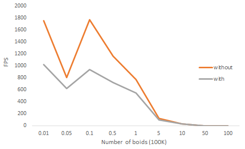
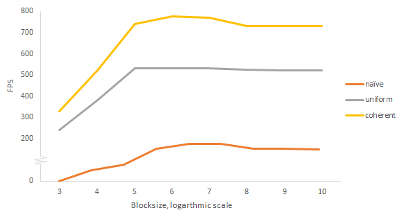

**University of Pennsylvania, CIS 565: GPU Programming and Architecture,
Project 1 - Flocking**

* Sarah Forcier
* Tested on: GeForce GTX 1070

### Screen Capture

| 100,000 boids | 5,000 boids | 
| ------------- | ----------- |
|  |  |

### Performance Analysis

#### Framerate change with increasing number of boids

#### Framerate change with and without visualization

#### Framerate change with increasing block size

### Q&A

#### How does changing the number of boids affect performance? Why?
Answer
#### How does changing the block count and block size affect performance? Why?
Answer
#### For the coherent uniform grid: did you experience any performance improvements with the more coherent uniform grid? Was this the outcome you expected? Why or why not?
Answer
#### Did changing cell width and checking 27 vs 8 neighboring cells affect performance? Why or why not?
Answer