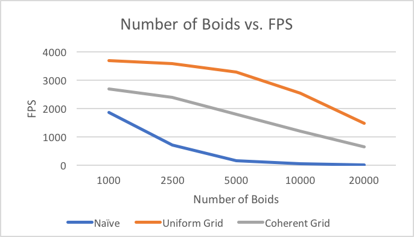
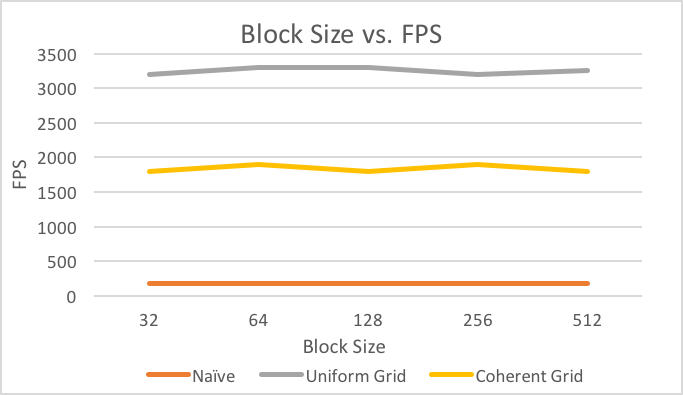

**University of Pennsylvania, CIS 565: GPU Programming and Architecture,
Project 1 - Flocking**

* Carolina Zheng
* Tested on: Windows 7, i7-6700 @ 3.40GHz 16GB, Quadro K620 (Moore 100 Lab)

### Performance Analysis
(Sorry, will add screenshot and GIF soon)

FPS was measured using CUDA timers on the simulation kernels only.

#### Number of boids vs. FPS

Changing the number of boids decreased performance for all three simulation types. This was the result I expected, since as the number of boids increases, so does the number of threads and, more importantly, the number of neighbors that need to be checked when velocity is updated.

#### Block size vs. FPS

Changing the block size didn't have a noticeable impact on performance for all three simulation types. This makes sense to me, since I wouldn't expect any of the kernel operations for this assignment to stall, nor did the kernels I write use an excess amount of memory.

#### Coherent vs. scattered uniform grid
My coherent grid was slower than the scattered grid. Initially, I was surprised by this, since I thought that eliminating a layer of indirection would be an optimization in terms of performance, but after thinking about it, my coherent grid could have been slower because the execution time for the extra kernel that sorted position and velocity outweighed the benefits of contiguous memory access of those two arrays. Also, there's a possibility that I implemented the nested loops incorrectly and didn't fully achieve contiguous memory access.

#### Varying cell width
These results are not graphed, but they were interesting. For the scattered grid, decreasing cell width and increasing the number of neighbors checked decreased performance by a factor of about 20%, whereas for the coherent grid, it *increased* performance by about the same factor. My best explanation for these results is that with the increased number of neighbors, the benefits of contiguous memory access for the coherent grid were magnified, whereas the scattered grid did not have this advantage, and it would need to check more entries in the cell start and end index arrays.
