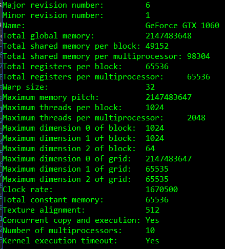
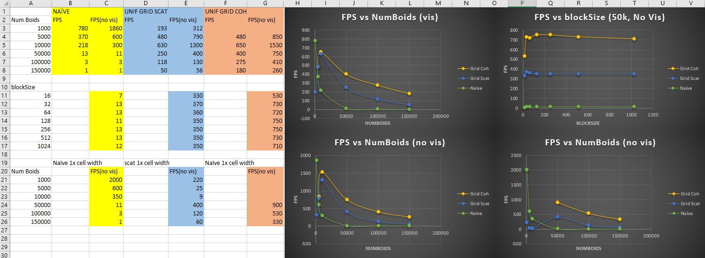

**University of Pennsylvania, CIS 565: GPU Programming and Architecture,
Project 1 - Flocking**

* Josh Lawrence
* Tested on: Windows 10, i7-7700HQ @ 2.8GHz 16GB, GTX 1060 6GB  Personal

For each implementation, how does changing the number of boids affect performance? Why do you think this is?
    - For all implementations increasing the number of boids decreases FPS expoentially. 
    There is simply more work to do with the same amount of resources, more warps pushing more requests on to the global memory bus.  
    It was interesting to see that naive was more efficent at 1000 boids vs the grid implementations. 
    This is likely because the grid implementations have additonal setup overhead and for low number of boids, most of this execution time is spent on this additonal overhead in small flock configurations.

For each implementation, how does changing the block count and block size affect performance? Why do you think this is?
    -Blocksize and count didn't have a drastic effect on perf but it did flucuate enough to notice. 
    There are many factors at play. Each SM on the GPU has a max thread and max block resource limit, whichever comes first.
    Each SM also has a max number of registers divided evenly amonst the threads. 
    If there are more registers needed for the kernel than it has, it can hurt perf when reg vals are getting evicted for new vals.
    In my blocksize graphs, a block size of 16 is the worst performing and 32 onwards is pretty much the same. This is likely because theres nothing going on in half of the warp that is issued from the size 16 block since warp size is 32 and pulled from threads in a block. 

For the coherent uniform grid: did you experience any performance improvements with the more coherent uniform grid? Was this the outcome you expected? Why or why not?
    -I did indeed see significant perf improvements but only when the num of boids was very large(50k+). Perhaps for a low number of boids, memory bandwidth and isn't a bottle neck but as the boids get to 50k+ having coherent memory can save a lot of trips to global memory. Hardware detects when threads in a warp are accessing adjacent spots in memory and instead of issuing fetches for each thread it combines the fetches into smaller batches that grab the same amount of memory. Like if cache line size is 512 bits (64 bytes) and each thread from 0 to 31 in the warp is requesting a float (4 bytes) in contiguous spots in memory then it might reduce those 32 memory fetch requests down to 2 (2 cache lines to fill up 32 floats that are contiguous in memory). reducing global memory traffic by a factor of 16.

Did changing cell width and checking 27 vs 8 neighboring cells affect performance? Why or why not?
    - Had a huge dip in FPS for 5k and 10k boids for grid scattered(blue line, bottom right graph), the other two methods had similar perf (actually slightly better) to the 2x cell width (8 neighbors). Don't really know why it would dip in perf on 5k and 10k for the grid scattered method. As for the slightly better perf on the 27 cell version, the 27 cell check is actually a tighter check versus the 2x width 8 cell check. Yes there's more cells but there are less boids to loop through. The 27 cell version is querying a volume of 27 (3x3x3) cubic max neighborhood radius where as the 8 cell version is querying a 64 (4x4x4) cubic max neighborhood radius so there's a lot of boids in the loop of the 8 cell version that are still too far away from the main boid and won't be counted, and in order to see how far away they are we need to query their pos data from global memory. The 27 cell version is a tighter bound so it has less boids to loop through and has a higher utilization of the boids in its cells making the warps less branch divergent. 
