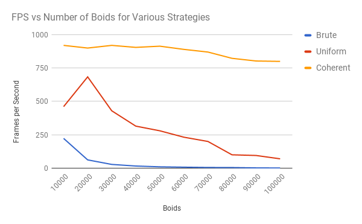
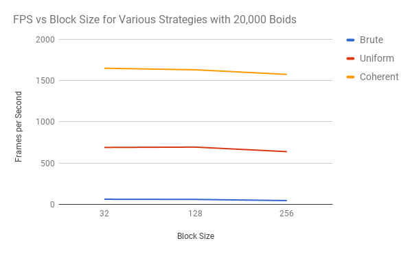

**University of Pennsylvania, CIS 565: GPU Programming and Architecture,
Project 1 - Flocking**

* Timothy Clancy (clancyt)
* Tested on: Windows 10, i5-4590 @ 3.30GHz 8GB, GTX 970 4GB (Personal)

## Results
Images taken at the point for each strategy where FPS is right about 60:

  

20k boids for Bruteforce, 100k for Uniform, and 350k for Coherent.

## Analysis

Once I'd completed the basics for each of the three flocking strategies, I recorded some trial runs.

### Framerate vs Boid Count

  

In constructing this graph, the framerate was measured for each data point 15 seconds after the start of the program. This was done to minimize the lag that I was always experiencing on startup. The data was retrieved from processes launched directly from the Visual Studio debug tools with "Release" mode. I chose this range of boid counts because I had already experimentally determined 100,000 boids to be the point where I would expect my Uniform grid implementation to run at approximately 60fps.

I'm not sure why the uniform grid initially starts slower and begins to work its way up to peak performance. The results otherwise are to be expected, with Coherent outperforming Uniform and both vastly outperforming the Bruteforce implementation. This helps validate my ideas for why Bruteforce is not scalable.

### Framerate vs Block Size

  

I used the same methodology to pick the framerate points for each of these runs. All of the points are multiples of 32, chosed because that is what I know to be the warp size--more on this from later analysis questions.

*For each implementation, how does changing the number of boids affect performance? Why do you think this is?*

For all implementations, increasing the number of boids degrades performance. This is because the flocking algorithms must check data from an increasing number of boids in order to compute new velocities. The Bruteforce approach deals with this increase very poorly--because it must check every single boid against all other boids, the runtime for computing new velocities grows O(n2) with the addition of more boids. The uniform and coherent grids also see a performance impact to more boids, but are overall more able to deal with the increase because every individual boid must check far less nearby boids in performing the flocking algorithms. In the case of the coherent grid, it outperforms the uniform grid. This is because there is one less layer of indirection once the dev_particleArrayIndices array is made obsolete.

*For each implementation, how does changing the block count and block size affect performance? Why do you think this is?*

None of the implementations appear to be particularly impacted by changing the block size. I think this is because the actual number of blocks, and by extension the number of separate allocations of shared memory, weren't bottlenecks. The boids didn't have much overlapping data with one another to leverage the advantages of being able to share a block; the bottleneck was in the velocity vector calculations. It is worth noting that I did not test any block sizes which were not a multiple of 32. These likely would have decreased performance because warps would have had to be split unevenly.

*For the coherent uniform grid: did you experience any performance improvements with the more coherent uniform grid? Was this the outcome you expected? Why or why not?*

I did experience a significant performance improvement, which I expected. By removing the need for dev_particleArrayIndices, we've improved data locality. The values needed from dev_pos and dev_vel are now stored contiguously and can be directly accessed using the index. This improves performance because memory can be loaded in large contiguous sections without jumping around now, which leads to some ability to optimize.

*Did changing cell width and checking 27 vs 8 neighboring cells affect performance? Why or why not?*

I have not yet completed this analysis.
