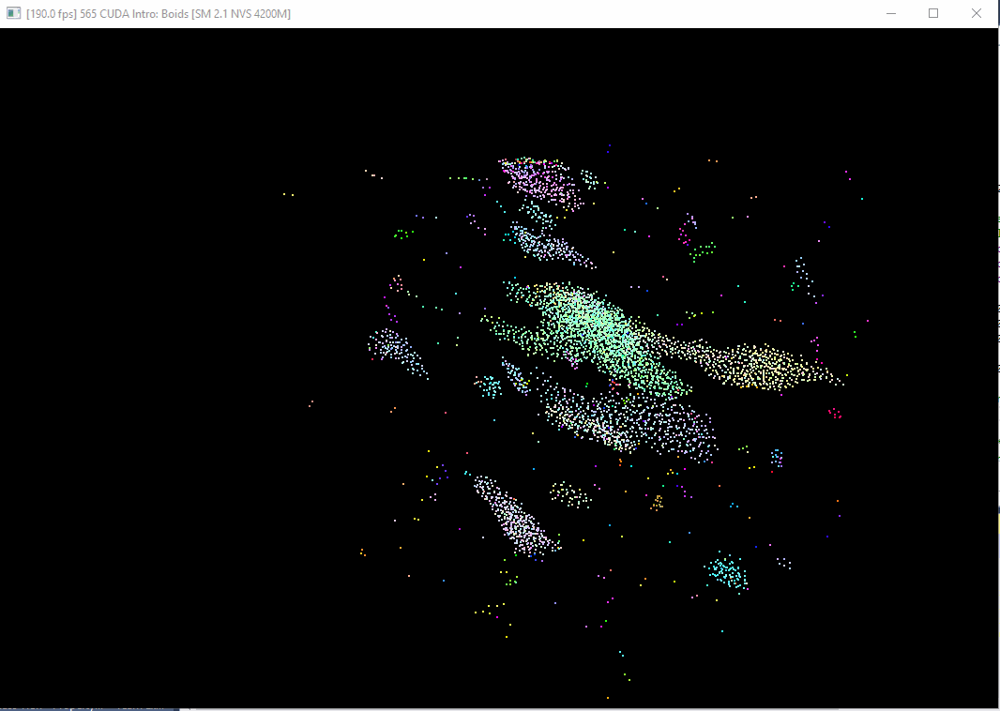
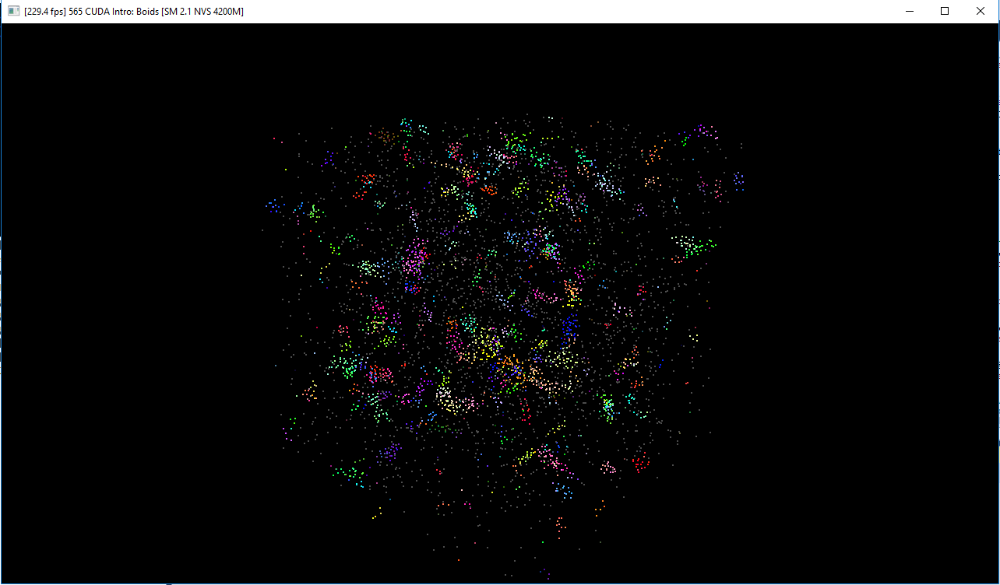
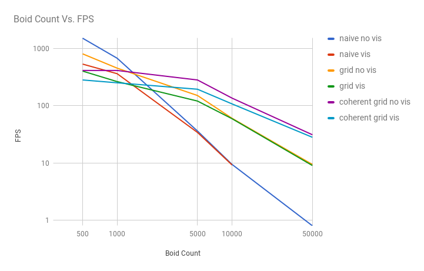
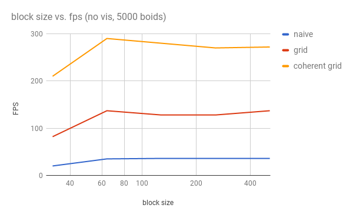
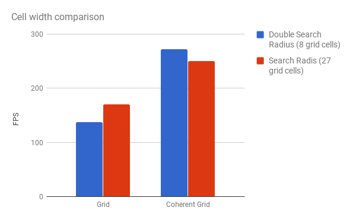

**University of Pennsylvania, CIS 565: GPU Programming and Architecture,
Project 1 - Flocking**

* Alexander Perry
* Tested on: Windows 10, i5-2410M @ 2.30GHz 8GB, NVS 4200M

## Images

## Analysis

### Boid Count

There are several interesting things to note in this graph.
First, the red line does not have a 50000 boid data point as I was unable to run the program on my computer at that input.

The next and most obvious, is that performance degrades as the number of boids increase.
Peak performance was at 500 boids while lowest performance was at 50000 boids getting down to single fps.

Thirdly, we can see that for all the simulations, there is a gap between the fps with visualization on an off.
This gap is more pronouced at lower boid counts where the time spent rendering is a more significant fraction of the total time.
As the fps decreases we can see that visualization has less of an effect.
In the case of the Naive approach and the Uniform Grid, the difference essentially vanishes by 10000 boids.

Next, we can see that the naive approach actually does the best by far with 500 boids.
However this advantage shrinks at 1000 and is gone by 5000.
By 50000 boids, the naive approach is at a standstill and the Coherent Grid is still cruising at 30fps.
We can conclude that at low boid counts where they hardly interact with each other, the overhead of sorting the boids takes more time than the naive approach of checking every boid.

Similarly we can see that the Coherent Grid does worse than the basic Uniform Grid at low boid counts but takes the lead by 5000 boids.
We can conclude that at low boid counts the extra lookup and cache misses are worth not having to sort the arrays.
However, as the density of boids increases, the extra lookups make the sorting worthwhile.

### Block size

In this graph, we can see that too small a block size is detrimental to performance.
I tested block sizes of 32, 64, 128, 256, and 512.
In all implementations, a block size of 32 had a performance hit of 30-40%.
After that a block size of 64 tended to perform the best.
However, the difference between a block size of 64 and any other option was not very significant.

### Cell width

This graph compares the fps of the basic Uniform Grid and the Coherent Grid when using grid cells with width equal to the search radius and double the search radius.
Using a cell width of double the boid search radius means searching 8 cells and a total volume of 64 times the boid search radius.
Using a cell width of the boid search radius means searching 27 cells but a total volume of 27 times the boid search radius.

The Uniform Grid has a slight advantage to searching all 27 neighboring cells with smaller cells comparing to checking larger cells.
This is because of the extra level of indirection, it is more efficient to search the smaller area.

The Coherent Grid has the opposite effect, where it is more efficient to search fewer cells than the smaller volume.
This is likely due to there being extra overhead in looking up the start and end of more cells.
I believe that as the number of boids increases and the density increases, the difference between the two lookup methods shrinks as the difference between 8 and 27 means less than looking up hundereds or thousands of neighboring boids.
