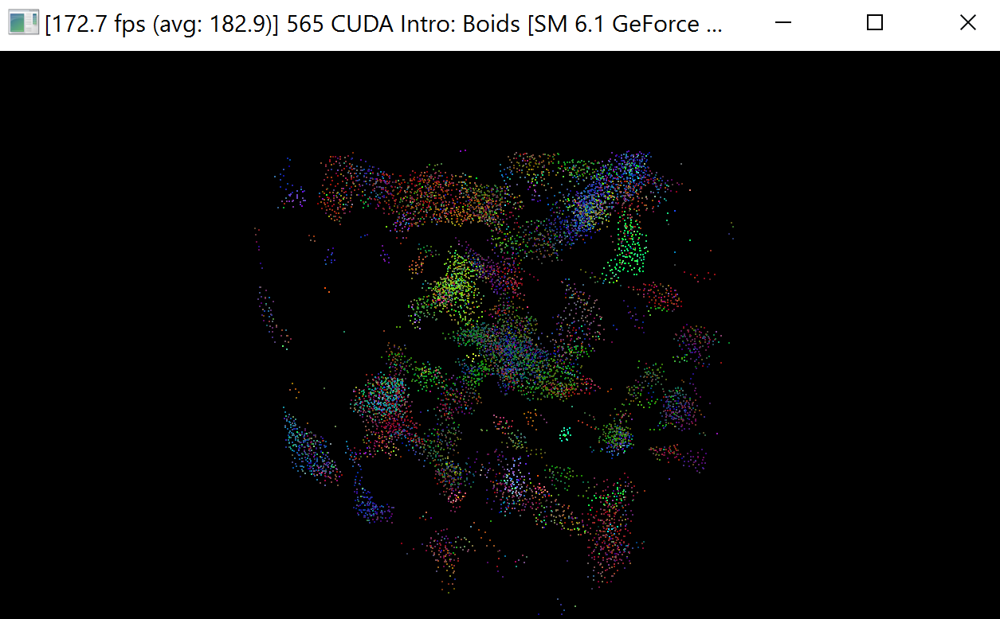
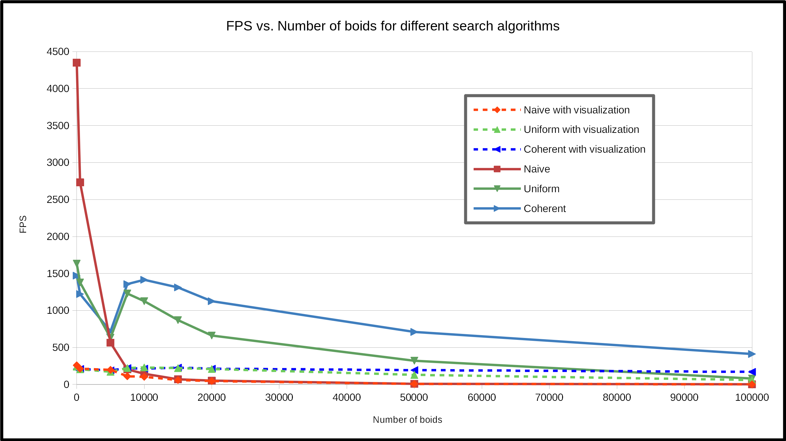
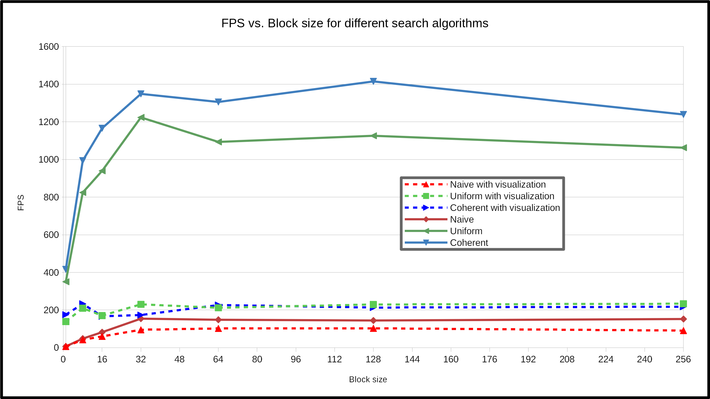

**University of Pennsylvania, CIS 565: GPU Programming and Architecture,
Project 1 - Flocking**

* Mauricio Mutai
* Tested on: Windows 10, i7-7700HQ @ 2.80GHz 16GB, GTX 1050Ti 4GB (Personal Computer)

### Overview

#### Introduction

The main aim of this project was to get myself acquaintanced with CUDA programming. After learning some basic CUDA concepts in class, I implemented this boid simulation in order to leverage the parallel computing capabilities of a GPU.

Three different search algorithms (naive, uniform grid, coherent grid) were implemented in order to investigate which provided the best performance for the simulation. In addition, smaller tweaks to these algorithms, such as CUDA block size, were tested as well.

Below are images of the final working project. More specifically, it is running the coherent grid search with 10000 boids, block size of 128, and cell width of two neighor distances.

#### Screenshot of boid simulation in progress

#### Animation of boid simulation in progress

### Performance Analysis

#### Methodology

I measured the performance of the simulation by using the frames per second (FPS) metric displayed on the window's title. I found that it fluctuated too much to give consistent readings, so I added the average of the last 10 FPS measurements to the window title as well.

When measuring FPS, I tried to keep the running environment as consistent as possible. For example, I noticed that having Chrome open directly under the running simulation led to significantly lower framerates than when Visual Studio was open in that position. Thus, I always measured with Visual Studio open, and waited at least 10 seconds for each measurement in order to have a more stable and consistent FPS reading.

Below, I examine the effect of several parameters of the simulation on its performance.

#### Number of boids

Below is a graph showing how FPS changes for the various search algorithms as the number of boids increases. For brevity, I will use "N" to refer to the number of boids in the simulation.

We can see the naive search starts off with the best performance for very small N. However, its performance drops drastically as N increases, such that, for more than 5000 boids, the naive solution is clearly inferior to the grid-based algorithms.

The better relative performance for small N can be explained by the low overhead of the naive algorithm. Since it requires less data to be copied and sorted, it saves time relative to the grid-based solutions. As N increases, searching the entire grid becomes more and more costly, such that the optimizations in the grid-based searches start making up for their overhead, and eventually they overtake the naive search's performance.

The uniform and coherent grid search algorithms have similar performance for N <= 5000, which suggests the memory optimizations of the coherent grid do not make a significant impact for sufficiently low N. As N increases, we generally see a decrease in performance, which is what we would expect, since each step of the simulation requires more neighbor boids to be checked, even with the grid optimizations. In addition, more boids need to be sorted and updated at each step.

Curiously, from N = 5000 to N = 7500, there is an increase in FPS for both grid-based solutions. This increase is not observed in the naive solution, which suggests it is caused by the grid-based search. I am not sure what is causing this local increase, since the expected number of neighbors each boid has to search for should increase along with N. One hypothesis I have is that using N = 5000 boids forced the GPU to use/allocate its memory in an inefficient way, whereas N = 7500 and N = 10000 lead to buffers that are allocated in more efficient and convenient locations in memory, allowing for quicker access. After this increase in performance, the expected downward trend returns for increasing N.

The graph above also includes data for the simulation's performance when visualization is enabled. For the grid-based solutions, we notice that the rendering of the boids becomes the bottleneck, since the framerate is significantly lower than when visualization is disabled, and remains roughly constant even as N increases. Interestingly, this does not occur for the naive case, where the simulation itself is the bottleneck. This can be inferred from the fact that the performance with and without visualization is almost the same for N >= 10000.

#### Block size

Below is a graph showing how FPS changes for the various search algorithms as the block size increases. The block count is automatically adjusted in the code as the block size changes: `dim3 fullBlocksPerGrid((N + blockSize - 1) / blockSize);`

