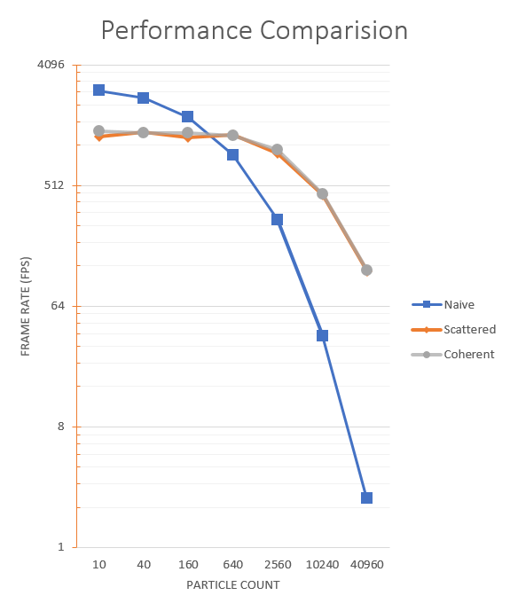
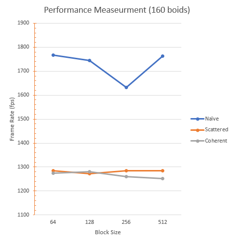
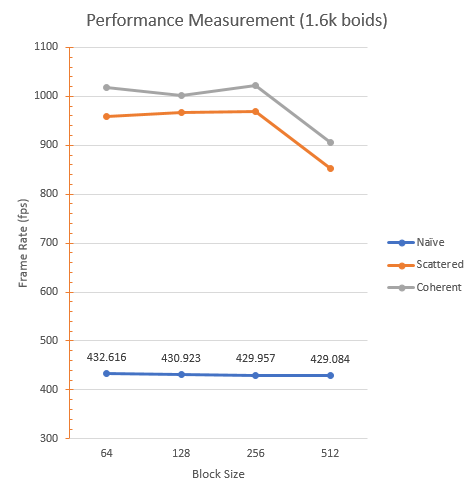
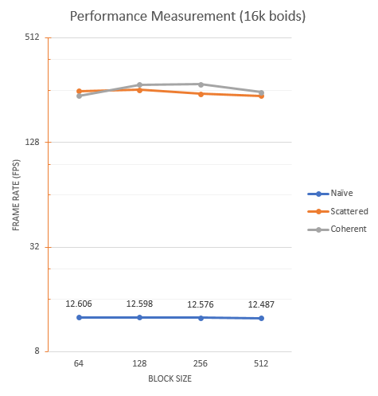

University of Pennsylvania, CIS 565: GPU Programming and Architecture,Project 1 - Flocking
===========================================
* Ziyu Li
* Tested on: Windows 7, i7-3840QM @ 2.8GHz 16GB, Nivida Quadro K4000M 4096MB (Personal Laptop)

## Performance Analysis
#### Kernel Performance Measurement

Start the program from release mode and disble the visualization. Next let the program runs 30 second for each test and write the frame rate measurement result every one second to a csv file which is easy to do the statistics works.There are seven different numbers of boids from 10 to 40960 for each naive, scattered uniform grid, and coherent uniform grid method. To make sure the results are accurate and avoid the GPU and CPU throttling, there is a 60 seconds cooling time between each test.

#### Results

+ 

**Performance Measurement under block size 128**  (the resutls below are averaged framerate in 30 seconds run)

For my performance measurement, the naive approach is faster than other two spatial accelerated implementation when the number of boids is low (approx. less than 160). But after I increase the boids from 640 to 40960, the advantage of spatial accelerated implementation is much more obvious.

Base on the results, but can see GPU can significantly increase the computational speed. On my benchmark, a delicate implementation on GPU can improve up to approx. 50 times faster than a naive approach.

There is a graph shows the comparison between these three implementation under different number of boids. 

+ 

 Num of boids   | Naive (fps)  | Scattered (fps)  | coherent (fps) | Max Performance Boost
  ---|---|---|---|---
  10 | 2613| 1188|1293| -50.52%
  40 | 2295|1284|1269 | -44.05%
 160 | 1659|1179|1263 | -23.87%
 640 | 863 |1223|1200 | +41.71%
2560 | 280 |892| 940  | +235.7%
10240| 38.2|431| 439  | +1049.%
40960| 2.32|116| 118  | +4986.%

**Performance Meaurement under different block size** (the resutls below are averaged framerate in 30 seconds run)

This performance measurement compare how block size will affect the performance. And there are three comparison benchmark under different boids size. The graph and results show below:

**1. boids size: 160**

+ 

Block size   | Naive (fps)  | Scattered (fps)  | coherent (fps)
  ---|---|---|---
  64 | 1767| 1285|1273
  128 | 1744|1271|1279
 256 | 1631|1284|1259
 512 | 1763 |1283|1252
 
 **2. boids size: 1.6k**

 + 

 Block size   | Naive (fps)  | Scattered (fps)  | coherent (fps)
  ---|---|---|---
  64 | 432| 958|1018
  128 | 430|967|1001
 256 | 429|970|1023
 512 | 429|851|905
 
 **3. boids size: 16k**

 + 

 Block size   | Naive (fps)  | Scattered (fps)  | coherent (fps)
  ---|---|---|---
  64 | 12.60| 253|236
  128 | 12.59|256|275
 256 | 12.57|243|277
 512 | 12.48 |237|248
 
#### Questions

**For each implementation, how does changing the number of boids affect performance? Why do you think this is?**

For all these three implementations, more "boids" means more computation and more memory usage. So A large number of boids will spend more time on computation and data transfer, and those will lead low framerate and dropping frames.

**For each implementation, how does changing the block count and block size affect performance? Why do you think this is?**

The tendency shows a large block size will make the simulation slightly slower based on different performance measurements, and a smaller block count will increase the performance slightly. I guess in theory, big block size situation is suitable for the MP contains more SPs. If a block contains too many threads, it will make the scheduler much more busy to arrange the works. However, it also will easier to separate those blocks on different MPs. So I believe, there should be a certain sweet-point for program under some conditions, which achieve the most optimal solution.

**For the coherent uniform grid: did you experience any performance improvements with the more coherent uniform grid? Was this the outcome you expected? Why or why not?**

I expectation is getting a huge boost which benefits on coherent uniform grid.  And I have three benchmark tests under different number of boids. But actually, based on those result, most of times, the coherent uniform grid is faster but not a huge different.

But for some cases, for instance, I have a performance benchmark has 160 boids, which I cannot see any improvement on performance. The reason of that is too less calculations on GPU, and rearrange the position and velocity buffer will cause a delay. Those delay will occupy a huge amount of computation time. 

However, for a large amount of boids, things are different. I think memory coherent and decrease indirection on this implementation will lead the performance boost. 

**Did changing cell width and checking 27 vs 8 neighboring cells affect performance? Why or why not?**

