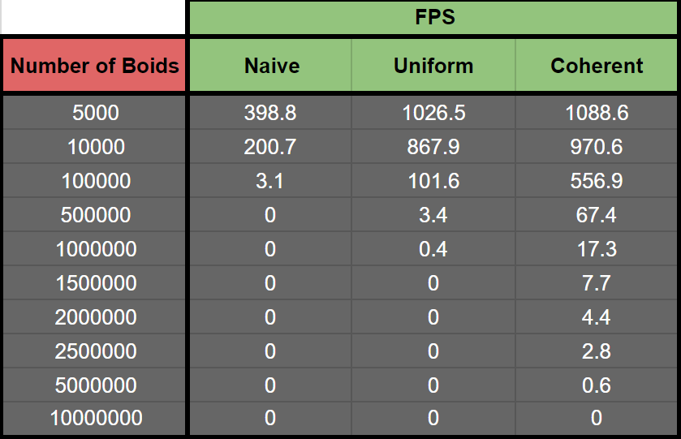
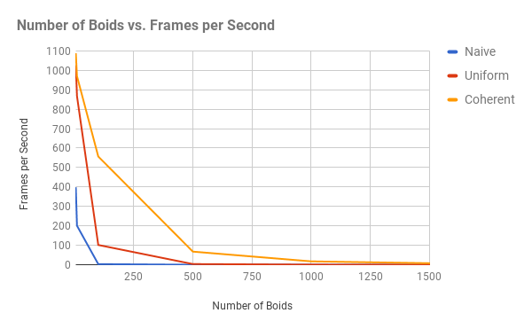
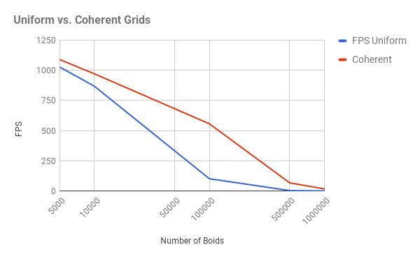

# Flocking with CUDA

**University of Pennsylvania, CIS 565: GPU Programming and Architecture,
Project 1 - Flocking**

* Jonathan Lee
* Tested on: Windows 7, i7-7700 @ 4.2GHz 16GB, GTX 1070 (Personal Machine)

## Overview

| 10,000 Boids | 100,000 Boids| 500,000 Boids|
| :---:        |     :---:      |          :---: |
|      |       |       |

### Flocking 
In this simulation, three types of steering were used to simulate flocking. 
1. Cohesion - boids move towards the perceived center of mass of their neighbors
2. Separation - boids avoid getting too close to their neighbors
3. Alignment - boids generally try to move with the same direction and speed as their neighbors

### Searching
1. Naive Search - Loops through all `N` boids to update position and velocity.
2. Naive Uniform Grid - Rather than looping through all `N` boids in the simulation, we only loop through the boids that are in the 8 neighboring cells of the current boid being processed.
3. Coherent Uniform Grid - This is similar to the Naive Uniform Grid however, this improves upon the Naive Uniform Grid in that we completely eliminate an extra fetch to obtain position and velocity. Because of this, there is a drastic improvement in performance.

## Performance Analysis
### Number of Boids 

With each of the three methods, the framerate eventually converges to 0 as the number of boids increases. I believe that this is due to the fact that each cell can contain more and more boids which requires an additional loop.

|   Naive vs. Uniform vs. Coherent |  |
| :---:        |     :---:      | 
|      |      |
|   |  |

### Block Size 
Decreasing the block size did cause a dip in performance across all three searches. I didn't notice any alarming performance differences at 32, 64, and 256. I believe that this is due to the warp size being capped at 32 threads. 

One thing that I noticed with changing the block size was that once I changed the blocksize to anything greater than 512, the simulation crashes with `too many resources requested for launch`. After researching the error, I found out that this meant that there weren't enough available registers on the multiprocessor to handle the block size.  

### Uniform vs. Coherent Grids
With fewer boids, the difference between the Uniform and Coherent Grids seems pretty insignificant. However, as you increase the number of boids, the difference becomes extremely noticable. Searching using the Uniform Grid requires an extra lookup through `dev_particlesArrayIndices` whereas searching using the Coherent Grid does not. A single index can provide the boid's position, velocity, and grid cell. 

|   Uniform vs Coherent    | |
| :---:        |     :---:      | 
|      |       |
|   |  |

### Neighbor Checking
Increasing the neighbor check from 8 to 27 neighboring cells caused a decrease in performance. In the chart below, we can see that the FPS decreases as more boids are added. Not only that, but the simulation crashed sooner for both Uniform and Coherent Grid Searches.

