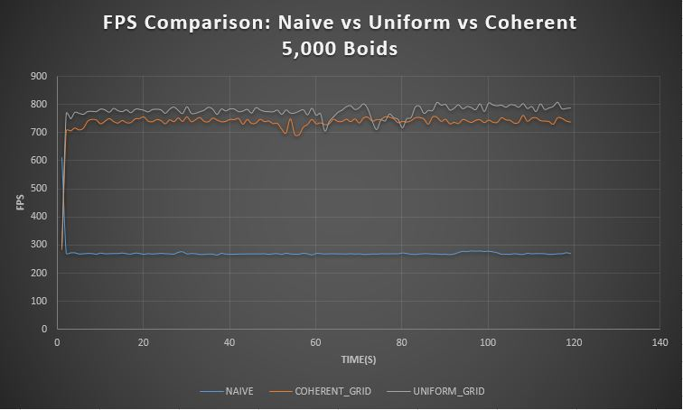

**University of Pennsylvania, CIS 565: GPU Programming and Architecture,
Project 1 - Flocking**

* Jiawei Wang
* Tested on: Windows 10, i7-6700 @ 2.60GHz 16.0GB, GTX 970M 3072MB (Personal)

## Results
___

The result above is **"Coherent Boids Flocking"**. The Parameters are as below:
* *N_FOR_VIS* = `10000`
* *DT* = `0.2f`
* *blockSize* = `128`
* *rule1Dsitance* : `5.0f`
* *rule2Distance* : `3.0f`
* *rule3Distance* : `5.0f`
* *rule1Scale* : `0.01f`
* *rule2Scale* : `0.1f`
* *rule3Scale* : `0.1f`
* *maxSpeed* : `1.0f`
* *scene_scale* : `100.0f`
* *width * height* : `1280 * 720`
* *pointSize* : `2.0f`

## Performance Analysis
___

### Performance testing:
The performance of ***Naive Boids***, ***Uniform Boids*** and ***Coherent Uniform Boids*** is measured using FPS along with the time. 

