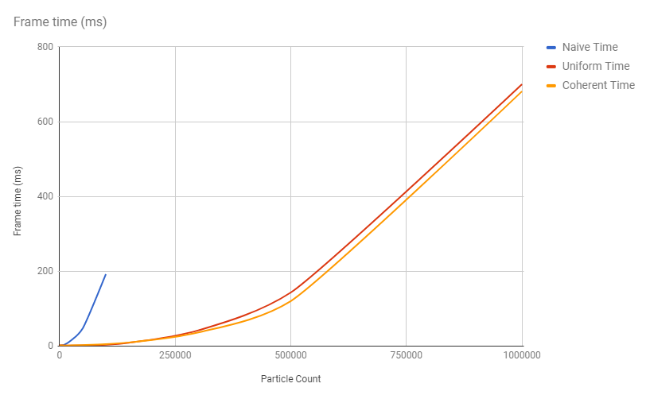
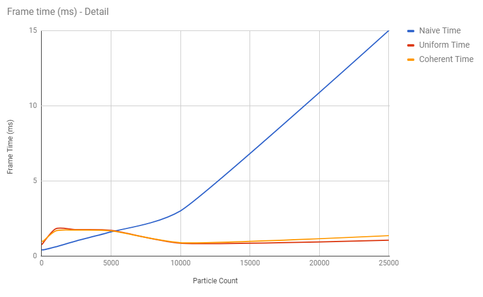
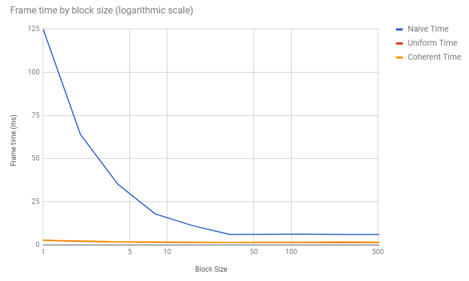
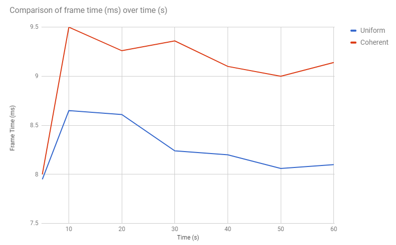
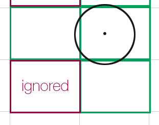
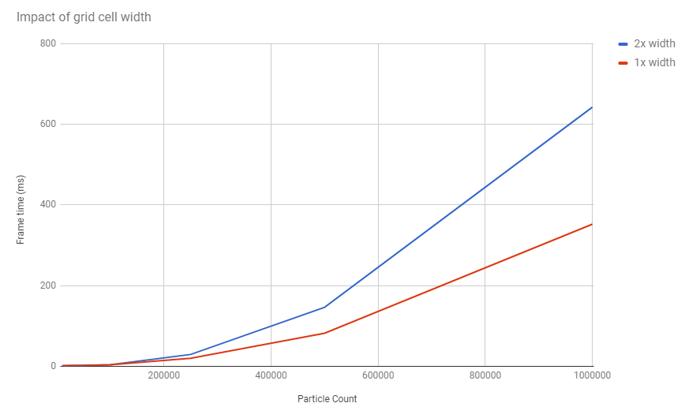

Project 1 CUDA Flocking
====================

**University of Pennsylvania, CIS 565: GPU Programming and Architecture, Project 1**

* Mariano Merchante
* Tested on
  * Microsoft Windows 10 Pro
  * Intel(R) Core(TM) i7-6700HQ CPU @ 2.60GHz, 2601 Mhz, 4 Core(s), 8 Logical Processor(s)
  * 32.0 GB RAM
  * NVIDIA GeForce GTX 1070 (mobile version)

## Details

This project solves a flocking simulation with three different implementations: a brute force approach, a uniform grid and a coherent version of this grid. It handles arbitrary cell size for the uniform grid, and tries to be as precise as possible when checking neighbor cells to prevent iterating unnecessary particles.

## Analysis

For evaluating performance, I used time per frame in milliseconds and disabled the visualization, so that there's no overhead from the actual rendering pipeline.

* A few details on how these implementations evolve with increasing particle counts:
  * For the brute force approach performance drops very quickly, because it scales with the square of the particle count. This happens due to the nature of iterating over every particle when looking for neighbors.
  * For the uniform grid approach, there's a slight initial overhead because of all the bookkeeping needed to maintain the grid, but it scales linearly over particle count.
  * The coherent grid approach evolves in a very similar way to the uniform grid; they both scale linearly and have some initial overhead.
  
  * A comparison of all three implementations.
  
  
  * A closer look at lower particle count shows the initial overhead due to implementation.

* Increasing block count affects performance until the amount of concurrent threads is enough to evaluate all the particles. After this point, there are no performance gains.
  
  * It is interesting to see how the brute force approach suffers the most from lower block count. This is due to its O(N^2) nature being hidden by adding more threads.

* It is interesting to compare the coherent grid vs the uniform grid approach. For the coherent grid approach, there's no obvious improvement in performance -- and actually it decreases a bit compared to the uniform grid. A reason for this could be that both implementations still access global memory and thus any improvement will depend on L2 size and speed. Also, the random access shuffle for particle indices every frame may impact performance more than the access of the neighbor cells' particles. With shared memory this approach should be considerably faster, however.
  
  * A comparison of how both methods evolve over time. The uniform grid is consistently better performing. This run used 50000 particles.

* Changing cell width affects the amount of cells that need to be checked when searching for neighbor particles. For the neighbor cell search, I use the flocking maximum radius to build a bounding volume of the search sphere. Then, I look for cells that intersect with this AABB, but then also filter cells by checking the actual collision with the sphere, so that corner cases can be properly ignored and potentially thousands of iterations prevented. However, I suspect that the AABB-sphere collision check adds a bit of overhead.

  
  * The ignored cell is initially considered but then discarded after intersection checking.

  
  * As this image shows, if the width is half the maximum neighbor radius, there are some performance gains. This happens because the amount of particles per grid cell is less, thus the cells on the periphery of the radius are better ignored. With other widths, such as 1/4x or 4x, performance drops.
