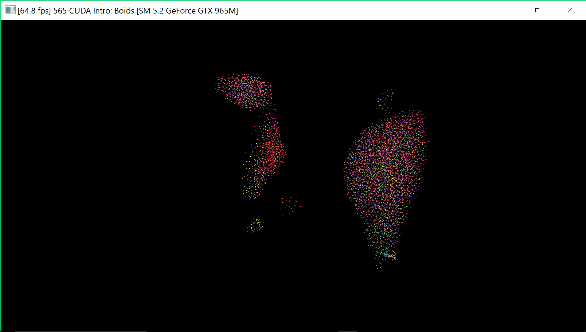
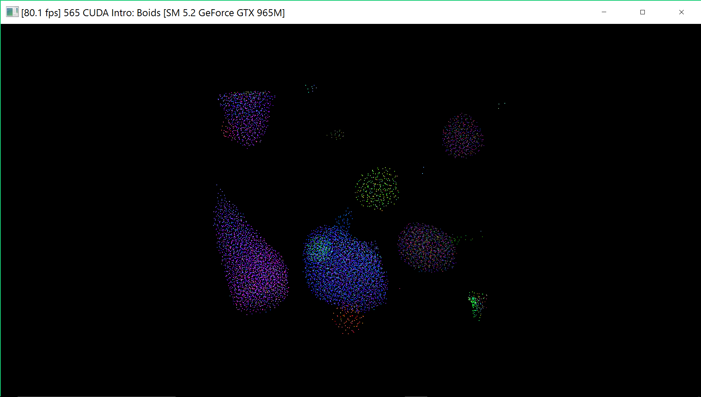

**University of Pennsylvania, CIS 565: GPU Programming and Architecture,
Project 1 - Flocking**

* (TODO) Anton Khabbaz
* Pennkey: akhabbaz
* Tested on: Windows 10 , i7-6600U @ 2.6 GHz 16 GB, GTX 965M 10000MB (personal Windows SUrface book)

### (TODO: Your README)

// update src/CMakeLists.txt  with '-arch=sm_52' since that is the cuda version supported on my graphics card.
p
I added a line to increase the frame rate by turning off vsync with
glfwSwapInterval(false) (Josh helped me).

Got 1.2 and the flocking to work in the naive case.  I changed parameters
and found that with 1000 boids I got a frame rate of 26 fps with my gpu.  

I wrote the code for 2.1 the grid search.   

I determined that the gridCells and the start and endIndices are correct.  This is all the input needed to update the velocity.
I am sure that the indices.  I ran the code with 100 boids and a 20 sized max radius.  These parameters worked for the naive grid and had the boids converge.  I used those to get the uniform grid scatter to work.  With those, I wrote a Boid::testGRidArray that transfeerred the intArrays to the host and printed them out nicely.  

Those indicated that the Start, End grid indices were correct.  Those algorithms that I wrote were all parallel, and had no loops over all the Boids.
For example to find the grid Start and stop I compared each gridCellindex and its predecessor.  There was no loop over all the Boids.

THere was a tricky routine to getting the neigboring cells.  I used the maximum of rule1 -3 distances, called maxdist and I added (maxdist, maxdist, maxdist) to the current Boid position. This was the upper limit of the gridcell that was needed.  I then realized that the 4 highest cells are next to (-1 in x, -1 in y, (-1, -1) in x, y) this cell.  Similarly I subtracted the same offset.  Since the cell width is 2 * maxdist, this measure will get the 8 cells and no grid cells outside of the core 8. This created an array of possible grid Cells Each thread pulled the boids in order of the grid Cells.  This way all boids in a cell are processed together and this seemed to help the speed.

A debugging issue that really slowed me down by about a day was that I could not break in any kernel inucluding the update velocity kernels using Nsight.  More specifically, I could break prior to running thrust, but afterwards the break points caused Visual Studio to stop with an error.  I checked the arrays with print statements and all the values were fine.  The debugging failure also occured in the naive implementation and that for sure was working.
Many people helped today including a TA, but we could not find the bug.

By selectively getting rule1 only to work and comparing with the naive solution, and by studying the code line by line, I traced down many bugs and got the grid Scattering to work.

The coherent Grid was straightforward.  I wrote a parallel kernel that would rearrange the position and velocity buffers according to the particle array buffer.  One extra position buffer was needed to prevent writing over values.

Results:

See the images and also the results of several time tests.
By considering all the boids in nearest neighbor, the rate was about 26 fps with 10000 boids (7 = maxdist). By using the uniform grid with Scattering and taking processing nearest neighbors at a time, I got a rate of about 205 fps.  By rearranging so that the boids were coherent and removing the indices, The reate improved to about 207 fps (slight improvement).  The uniform grid sped up the processing by about a factor of 8.  The coherent grid did better because boids in one grid were all in contiguous memory.  The scatter was nearly as good.  Boids there were still processed in grid order and I think for that reason the data was cached and so the processing time was nearly as good.

Increasing the number of boids sightly reduced processing time: at 50000 the rate was about 156, about a 25% reduction in frame rate. I think the effect is low because of the parallel architecture.  tripling the grid size (from 7 to 20) reduced the rate by over a factor of 9; now there are about 27 times as many neighbors, so it is expected that the rate would be reduced by a huge factor.   Since there is only 8 grid cells that could possibly contribute, increasing the grid count would only slow down the frame rate further.
Include screenshots, analysis, etc. (Remember, this is public, so don't put
anything here that you don't want to share with the world.)

:
