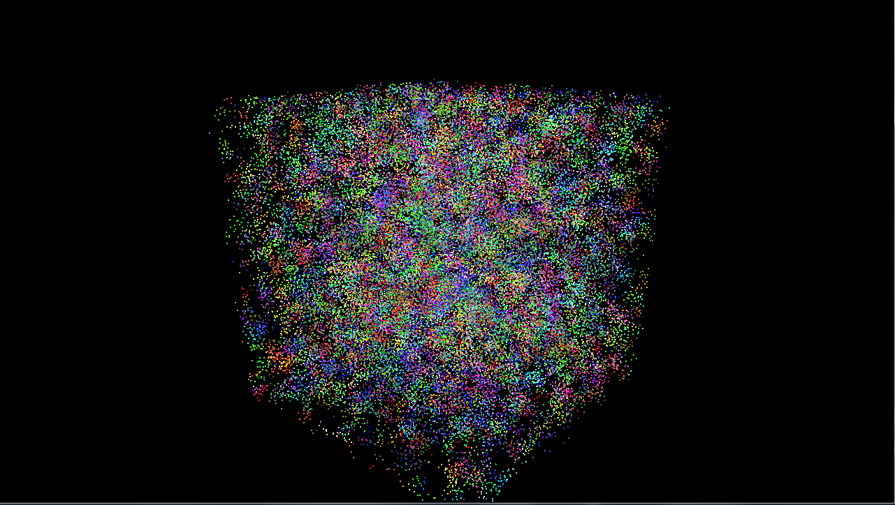
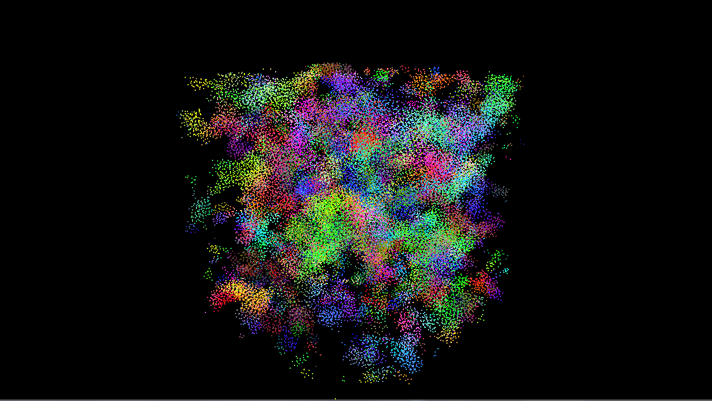
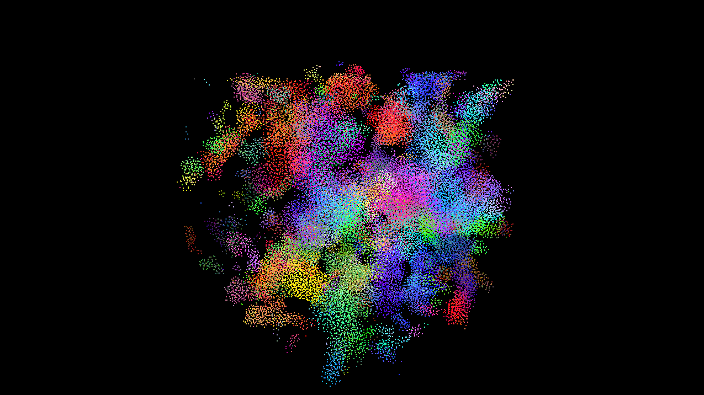
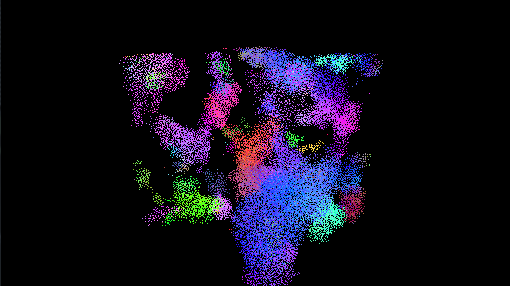
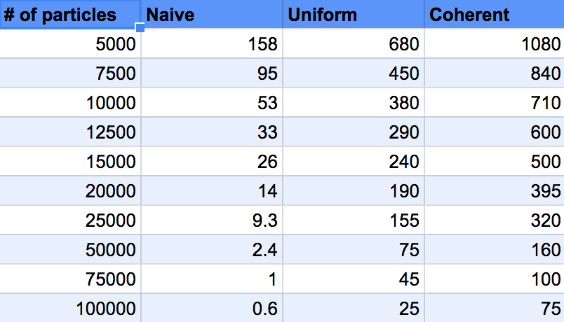
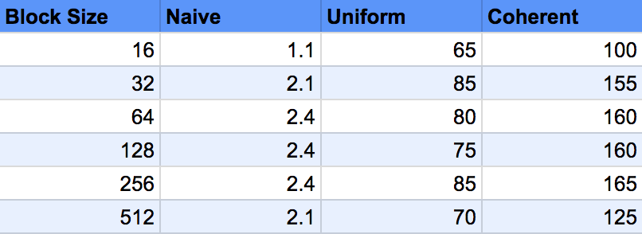
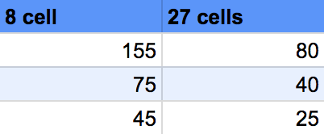

**University of Pennsylvania, CIS 565: GPU Programming and Architecture,
Project 1 - Flocking**

* Wenli Zhao
* Tested on: Windows 7, i7-6700 CPU @ 3.40GHz, NVIDIA Quadro K620 (Moore 100C Lab)

## ReadMe
### Naive Flocking

### Coherent Grid, N = 50,000
#### Part 1

#### Part 2

#### Part 3

#### Part 4

## Analysis
For performance analysis I modified variables including block size and number of particles for each of the methods implemented.

The frames per second rate was recorded either when the rate stabilized or after about ten seconds of running the program.

###  Frames Per Second for varying # of Particles

Changing the number of boids very clearly decreased the performance as measured by FPS. When the number of voids increased, the FPS was also more variable and would not reach a steady state as quickly, especially for the uniform grid methods. Overall, the uniform coherent grid performed the best and both uniform methods performed significantly better than the naive method.

### Frames Per Second for 50,000 Particles for varying Block Size

I chose to test the block size with 50,000 particles at block sizes in powers of two. The performance seemed to increase for increasing block sizes and then taper off. I also tried varying block sizes with 5000 particles, but I did not record very much variation in performance. The block size did not realy affect the performance on my machine unless I increased the block size greatly. I think this is due to the number of cores on the machine I worked on. If the computer had less processing power, then the block size might affect performance for fewer particles.

### Frames Per Second for Uniform Grid Scattered Neighbor Search 8 vs. 27

I modified my code to run the uniform grid to check 27 neighbors rather than 8. Checking more cells caused the FPS to drop by almost half. Checking more neighbors for each boid comes at a performance cost.

### Summary
Increasing the number of boids decreased performance. Increasing block size increased performance at first, but after a point does not make a difference. The coherent uniform grid performed best. This was the outcome I expected. Checking more neighbors decreases performance.

