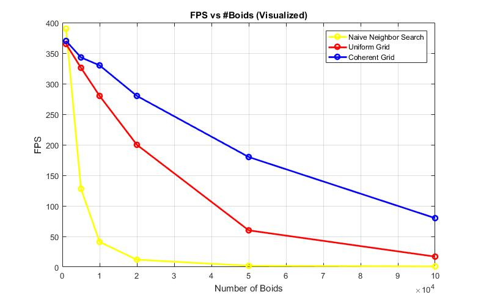
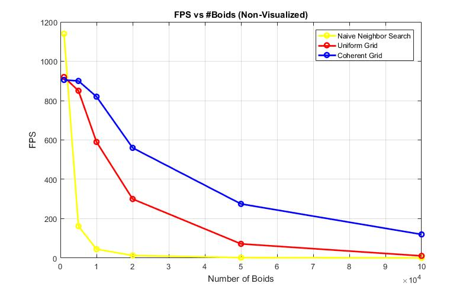
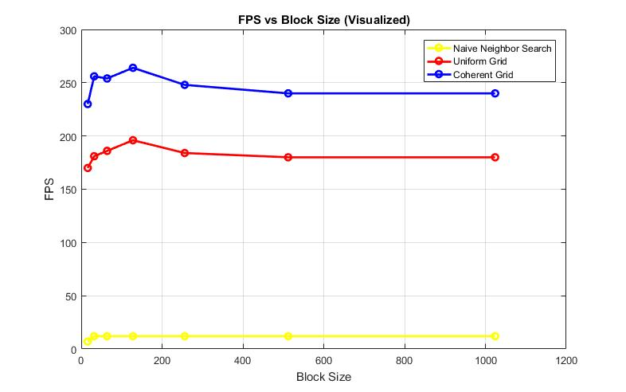

**University of Pennsylvania, CIS 565: GPU Programming and Architecture,
Project 1 - Flocking**

* Yash Vardhan
* Tested on: Windows 10 Pro, Intel i5-4200U (4) @ 2.600GHz 4GB, NVIDIA GeForce 840M 2048MB

Boids Flocking using coherent uniform grid
===========================================

Performance Analysis
====================

FPS vs Number of Boids(Visualized)
----------------------------------

FPS vs Number of Boids(Non-Visualized)
--------------------------------------

FPS vs Block Size 
------------------

