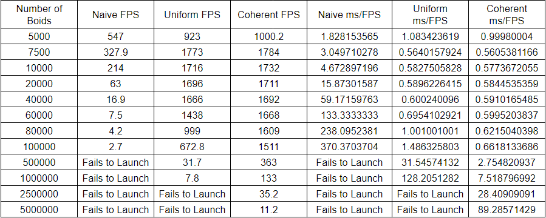
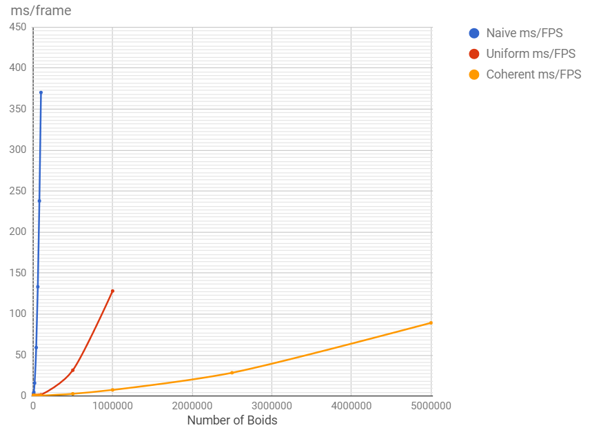
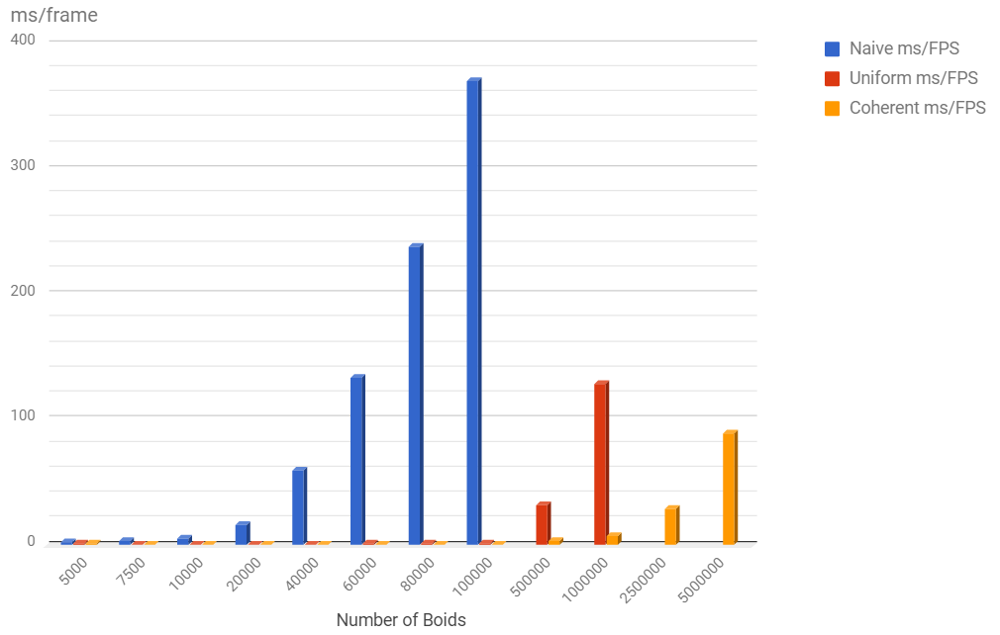
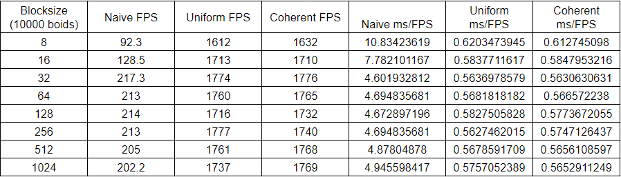
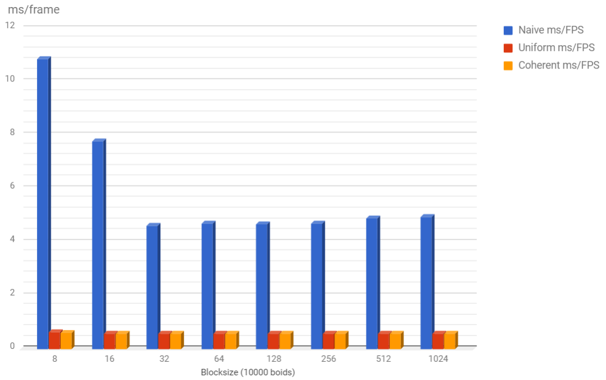
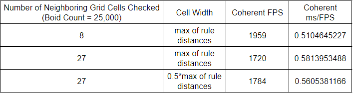
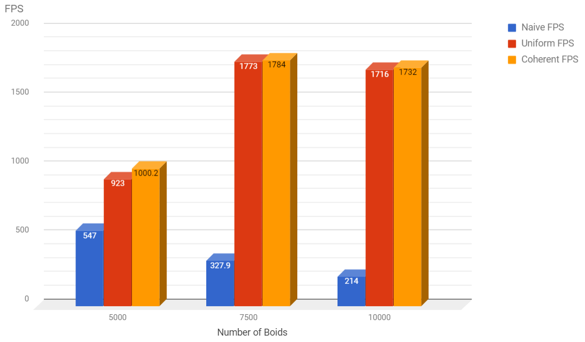

Project 1 Boids with CUDA
==========================

**University of Pennsylvania, CIS 565: GPU Programming and Architecture,
Project 1 - Boids**

* Aman Sachan
* Tested on: Windows 10, i7-7700HQ @ 2.8GHz 32GB, GTX 1070(laptop GPU) 8074MB (Personal Machine: Customized MSI GT62VR 7RE)

### Overview

###### (Run on GTX 1070(laptop GPU) with 25000 boids, recorded at 10fps due to file size limitations of github, actual solution runs much faster and smoother)

This project served as an introduction to CUDA kernels, how to use them, and how to analyze their performance. This was done by implementing the Reynolds Boids algorithm in parallel on the GPU.

Boids is a crowd simulation algorithm developed by Craig Reynolds in 1986 which is modeled after the flocking behaviors exibited by birds and fish. The most basic version of the algorithm operates on three rules:
* Cohesion: Boids will try to move towards the perceived center of mass of other boids around them.
* Alignment: Boids will tend to steer in the direction of the perceived average movement of other boids around them.
* Separation: Boids will try to keep some amount of distance between them and other boids.

### Three implementations:
#### 1. Naive

The naive approach for computing the new positions and velocities for the boids is to check each boid against every other boid and apply the three rules described above. This is extremely slow with a time complexity of O(N^2). 

A simple way to implement this in CUDA is to have one thread for each boid. Each thread would loop over the entire position and velocity buffers (skipping itself) and compute a new velocity for that boid. Then, another CUDA kernel would apply the position update using the new velocity data.

#### 2. Uniform Scattered Grid

It is quite obvious that a spatial data structure can greately improve performance for the algorithm. If we reduce the number of boids each boid needs to check against, we can decrease the amount of work each thread needs to do. Because the three rules only apply within a certain radius, organizing the boids on a uniformly spaced grid allows us to perform a very efficient neighbor search and only check a very limited number of boids. We choose our uniform grid cell width to be twice the maximum search radius. This makes it so that at most, a boid may be influenced by other boids in the 8 cells directly around it.

To create the "grid" we create an additional CUDA kernel which fills a buffer with respective grid cell indices. A parallel sorting algorithm, thrust::sort_by_key, is then used to sort boid indices by their corresponding grid cell indices. Furthermore, we store the "start" and "end" indicies for each grid cell in two new buffers by checking for transitions in the sorted grid cell buffer.

Now, instead of checking against all other boids, each thread in our velocity update can determine the boids grid index based on its position; this then allows us to determine the 8 neighboring cells in 3D space, and only apply rules for those boids that have an index between "start" and "end" of a neighboring cell.

#### 3. Uniform Coherent Grid

We can make the uniform grid spatial structure better by making memory accesses more coherent. The uniform scattered grid implementation does unecessary hopping and "pointer"-chasing. Instead of using an additional sorted buffer to find the index into our particle data, we can shuffle the particle data so that it is also sorted by grid cell index. This allows the GPU to load in and cache our position and velocity data for the boids resulting in fewer global memory calls. This small change ends up making signficant performance improvements.

### Performance Analysis

#### Effect of boid count on framerate

Tests were done using a block size of 128

##### DataPoints for Naive are missing beyond 100000 boids, and Uniform scattered grid beyond 1 Million as the CUDA kernels refused to launch with such high boid counts for those two approaches.

As would be expected, as the number of boids increases, all 3 approaches suffer slowdowns. However, the line graph above clearly shows drastic things. We can see that using the Uniform Scattered Grid greatly improves performance and then the Uniform Coherent Grid surpasses even that in terms of performance. Intuitively, this makes sense. Using the Uniform Scattered Grid we greatly reduced the number of boids that have to be checked against for each boid. Making the boid data more memory coherent allowed us to access data(memory) faster because of better caching and reduction in the number of calls to global memory. This made Uniform Coherent Grids Perform that much better. 

#### Effect of block size on framerate

Tests were done using a 10000 boids

Looking at the bar graph we can see that the blocksize really only effects one implementation, that is the Naive implementation beginning at a block size of 32. This might be because at 32 or fewer threads per block, there is only one warp (a group of 32 threads) in a block. These smaller blocks mean that we need a larger number of blocks. With every warp in its own block, we lose the performance benefits of shared memory within a block and instead need to allocate memory for each of our very many blocks.

It is curious that the blocksize doesn't affect Uniform Scattered and Uniform Coherent Grid implementations too much. At a blocksize of 8 however, looking at the datatable we can see a drop in framerate for both of them although it isn't as drastic as it is for the Naive implementation. My guess is that with even smaller blocksizes we would see worse and worse framerates for all the reasons described above, for all the implementations.

#### Effect of checking 27 gridcells instead of 8 with halfed grid cell size

As can be seen in the table above increasing the number of neighboring grid cells you are checking while appropriately changing the width of the cells, results in a lower framerate. This is because we have essentially just increased the overhead for maintaining the grid without a significant reduction in the number of boids we check. If we manipulate the ratio of 'cell width' to 'the number of neighboring grid cells that have to be checked' we could possibly result in cases where the 27 neighboring grid cells would result in a better framerate.

#### Drastic fall in framerate

If we zoom into to the first few data points, we can notice a sudden jump that almost doubles our framerate while increasing the number of boids. At first glance, this seems kind of absurd, but it is more likely that in some situations, the number of boids do not map well into the memory of the underlying architecture which leads to a frustrating reduction in framerate.

#### Worst-Case Scenario for Uniform and Coherent Grids

While trying to code this project, I ran into a ridiculous bug that made my Uniform Scattered and Uniform Coherent Grids perform significantly worse than my Naive implementation. I may have inadvertently coded up the worst-case scenario for both these methods. The issue arose because I had divided my boid's position along all three axes by the 'grid resolution'. And I then used that position to calculate an index into the gridcells. However, because I had divided by the 'grid resolution' the index that I obtained for every boid was the same index, i.e they were all in the same grid cell. This meant that I was basically running my Naive implementation inside one grid cell along with the overhead of creating and maintaining extra buffers for the grid structure, and doing a bunch of computation to determine which gridcells to look at. A stupid mistake but with mildly interesting insight.

### Feedback

If anyone reaches this far and happens to see any issues with my analysis or something else that I missed, please feel free to submit an issue and let me know! Any other feedback is also appreciated.
