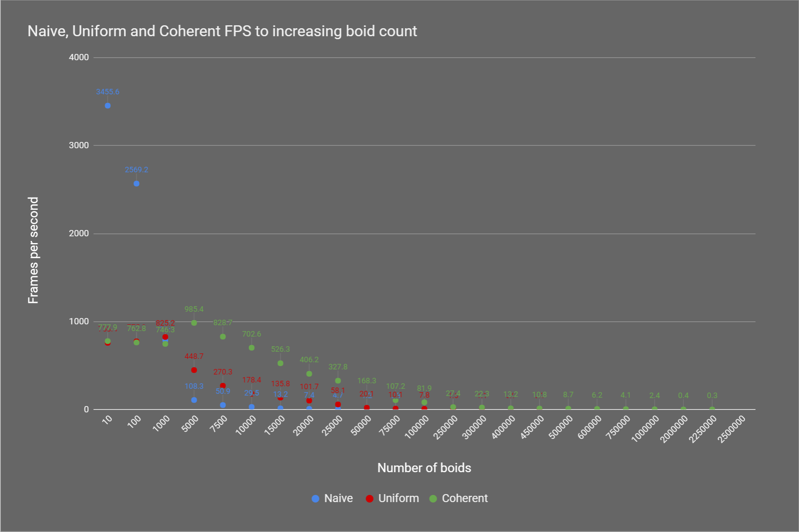
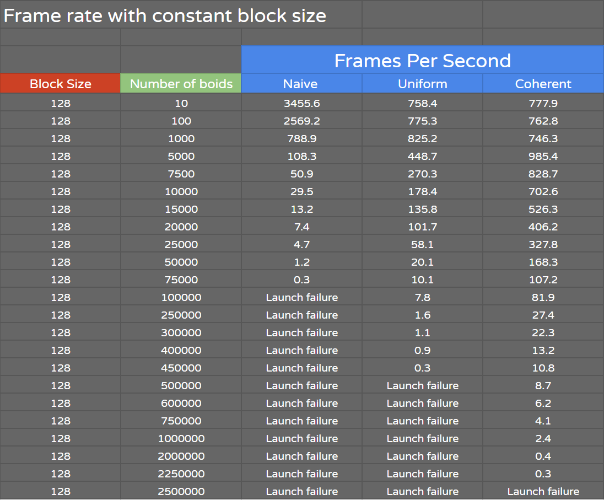
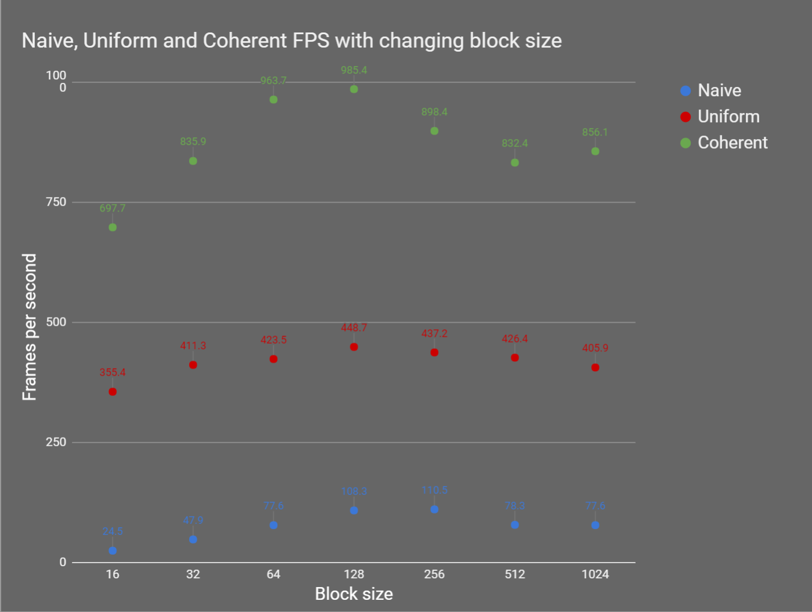
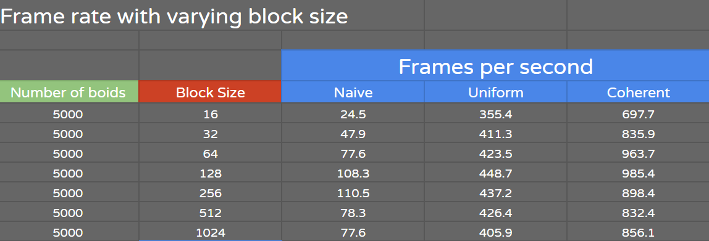

**University of Pennsylvania, CIS 565: GPU Programming and Architecture,
Project 1 - Flocking**

* Name: Meghana Seshadri
* Tested on: Windows 10, i7-4870HQ @ 2.50GHz 16GB, GeForce GT 750M 2048MB (personal computer)

## Project Overview

The goal of this project was to get an introduction to utilizing CUDA kernels - an optimization technique that runs code parallel on the GPU. For this project, a "boid" flocking system was implemented based on the Reynolds Boids algorithm.

In the Boids flocking simulation, particles called "boids" move around in the simulation space according to the following 3 rules:

1. `Cohesion` - Boids try to move towards the perceived center of mass of neighboring boids
2. `Separation` - Boids try to maintain a certain distance between them and neighboring boids
3. `Alignment` - Boids generally try to move with the same direction and speed as neighboring boids

These 3 rules specify a boid's velocity change within a timestep. At every timestep, a boid looks at all of its neighboring boids within a certain neighborhood radius and computes the velocity change contribution according to each of the 3 rules. 

Naively, this means checking against every other boid in the simulation to see if they're within the radius, however, this is a very inefficient method. On the GPU, this means that each boid's change in velocity and position will be calculated on a single thread. 

Instead, the following optimzations were implemented: 

* A uniform spatial grid, and
* A uniform spatial grid with semi-coherent memory access

### Uniform Spatial Grid

We can greatly reduce the number of neighboring boid checks, and thus improve performance, by using a data structure called a uniform spatial grid. A three dimensional uniform grid is made up of same-sized cells that cover the entire simulation space. Since we only have to search for boids within a radius, dividing up the simulation space uniformly allows us to do this much more efficiently. Essentially, we're limiting the number of boids to check against by only checking those that fall within the radius versus checking **every** boid.

When finding a boid's neighbors, the width of each cell dictates how many surrounding cells need to be checked. If the cell width is:

* Double the specified radius, then each boid must be checked against other boids in 8 surrounding cells
* The same size as the specified radius, then each boid must be checked against other boids in 27 surrounding cells. 

**Note: Increasing the number of cells to be checked against does impact performance. Scroll down to the Performance Analysis section to read more about it.**

Three dimensional data is stored in the following one dimensional buffers:

* `pos` - stores all boid position data
* `vel1` - stores all boid velocity data
* `vel2` - stores all updated boid velocity data
* `particleArrayIndices` - boids are identified by an index value and stored here. This is used to access their corresponding position and velocity 
* `particleGridIndices` - stores the grid cell number each boid is located in
* `gridCellStartIndices` - stores the start index values to utilize when searching through particleArrayIndices to find which boids are in a grid cell
* `gridCellEndIndices` - stores the end index value to utilize when searching through particleArrayIndices to find which boids are in a grid cell

First, boids are identified by an index value (particleArrayIndices) as well as which grid cell they're located in (particleGridIndices). Next, they are sorted according to their cell location, which ensures that pointers to boids in the same cell are contiguous in memory. We can then further abstract this by storing the start and end index into particleGridIndices of each grid cell. This way, given a cell, we can easily find which boids are in it as well as its surrounding cells.

### Uniform Spatial Grid + Semi-Coherent Memory Access

The uniform spatial grid can be further optimized by making memory access to boids' position and velocity data memory-coherent. Instead of finding which boid index from particleArrayIndices we need to access the 
a boid's position and velocity buffers with, we remove the abstraction involving particleArrayIndices.

Just sort the position and velocity buffers according to the order of the grid cells (particleGridIndices), and create two new buffers (coherent_pos and coherent_vel) that store each boid's position and velocity data in this order. We can just directly access these new buffers when calculating the change in a boid's position and velocity.

## Performance Analysis 

### Framerate change with increasing boid count

**The following graph and chart show the change in frame rate with increasing boid count. They were measured using a block size of 128. Testing with and without the visualization of the simulation produced very little differences.**

`Question One:` For each implementation, how does changing the number of boids affect performance? Why?

`Answer:` Relatively, greatly increasing the number of boids greatly decreases performance across all three implementations. Although, we can see that using the uniform grid and coherent memory access greatly improves performance compared the naive implementation. As explained above, this is because we are greatly reducing the number of boids we need to check against. 

What's interesting to note though is, with a boid count of less than 5000, we can that the naive implementation is much more efficient than the uniform grid and coherent memory access. This is probably because with such a small number of boids, checking against every one of them ends up being more efficient than all the set up required for the other two optimization methods. Although, with 5000 and more boids, the naive implementation has a huge decrease in performance expontentially.

`Question Two:` For the coherent uniform grid: did you experience any performance improvements with the more coherent uniform grid? Was this the outcome you expected? Why or why not?

`Answer:` Utilizing a coherent uniform grid also greatly improved performance. This outcome was expected since as explained above, removing the abstraction of the particleArrayIndices buffer and the subsequent 'pointer hunting' we must do with it improves the performance. We can see that making memory access of each boid's position and velocity more memory coherent allows the simulation to operate with 20 times more boids than just using the uniform grid.

### Framerate change with increasing block size

**The following graph and chart show the change in frame rate with increasing block size. They were measured using a boid count of 5000.**

`Question Three:` For each implementation, how does changing the block count and block size affect performance? Why do you think this is?

`Answer:` Each block contains warps that run 32 threads. With block size values lower than 32, a decrease in performance can be seen probably because we are reducing the block to have only one warp with less than 32 threads actually being used, and thus we would need more blocks to accomplish the same amount of work. 

`Question Four:` Did changing cell width and checking 27 vs 8 neighboring cells affect performance? Why or why not?

`Answer:` Changing cell width and the number of neighboring cells to check from 8 to 27 at first shows a decrease in performance as the boid count increases. However, when testing really high boid counts (~100000 and greater), we can see that performance begins to improve with the 27 neighbor case.

While we are checking **more** surrounding cells with a grid cell width that's equal to the radius, we're  checking only a span of 3 * radius in each dimension. Whereas with 8 cells, we're checking a span of 4 * neighborhood radius (since the grid cell width is 2 times the radius). Ultimately, we end up searching in a greater area in the simulation space with 8 neighboring cells versus 27.