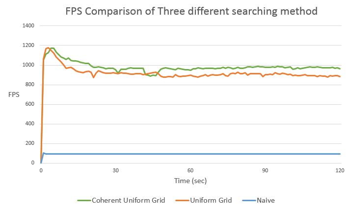
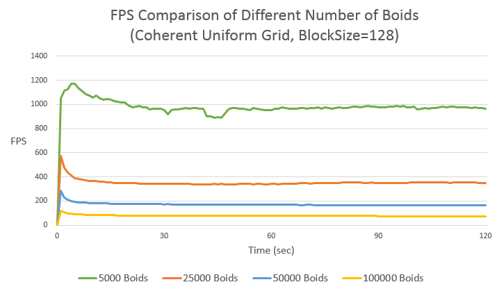
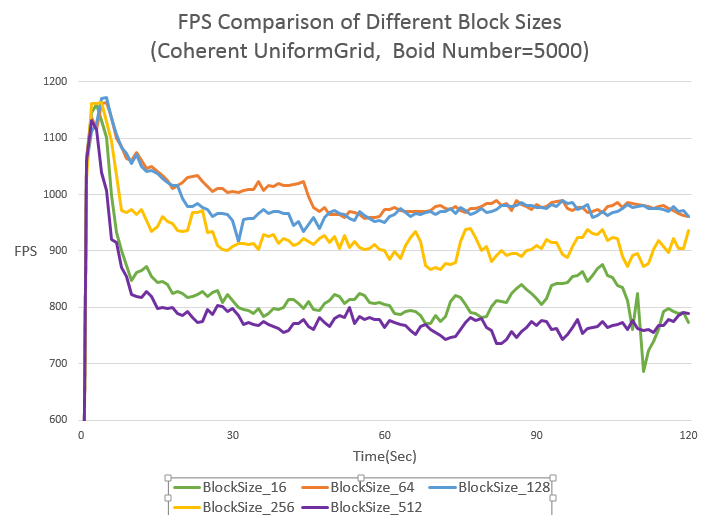
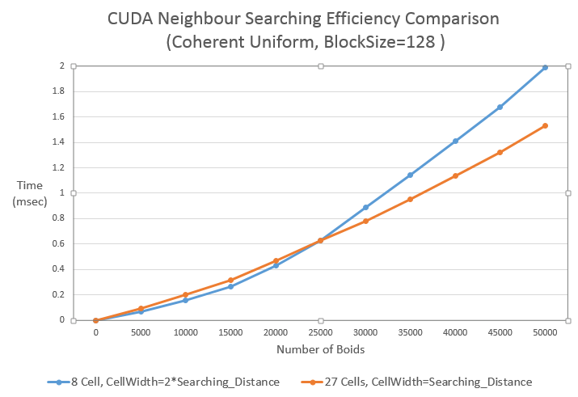

**University of Pennsylvania, CIS 565: GPU Programming and Architecture,
Project 1 - Flocking**

* (TODO) Yi Guo
* Tested on:  Windows 8.1, Intel(R) Core(TM)i5-4200M CPU @ 2.50GHz 8GB, NVIDIA GeForce 840M (Personal Notebook)

## Description
     
This is the Project 1 of the course of GPU Programming and Architecture. The project is about the simulation of flocking behavior based on the GPU parallel computation. For the instructions of the project, see `INSTRUCTION.md`. Here are the demos and performance analysis of the project.
           
## Screenshot 
         

    
The  Parameters for the blocking behavior shown above are listed as below:
* *Grid Type* : Coherent Uniform Grid
* *CellWidth* : 2 times of the greatest value of rule1Dsitance,rule2Distance and rule3Distance
* *Number of Boids* : `5000`
* *TimeStep* : `0.2f` 
* *BlockSize* : `128`
* *rule1Dsitance* : `5.0f`
* *rule2Distance* : `3.0f`
* *rule3Distance* : `5.0f`
* *rule1Scale* : `0.01f`
* *rule2Scale* : `0.1f`
* *rule3Scale* : `0.1f`
* *maxSpeed* : `1.0f`
* *pointSize* : `2.0f`

## Performance Analysis

For the performance Analysis, we need to answer and explain the following questions.

* **In the project, 3 methods of paralle computing are implement, which one is the most efficient and why?**

I compare the efficiency by comparing the fps value. Fps(frame of rate) is the frequency (rate) at which consecutive images called frames are displayed in an animated display.In this project, the more efficient our parallel computing is, the higher the fps will be. Here is the plot of the fps value of three different methods.

As the graph indicates, using **Coherent Uniform Grid** for searching neighbours will be the most efficient way and using **Naive Method** will be the least efficient one. It makes sense that the **Naive Method** will be the slowest because it needs to search for neighbours in the whole space while the rest 2 only search in the neighbour cells. As the graph shows, the naive method will be almost 10 times slower than the other 2 methods.

The difference between **Coherent Uniform Grid** and **Uniform Grid** is that they use different ways to allocate and visit the global memory of GPU. Global memory access on the device shares performance characteristics with data access on the host. However, visiting the global memory directly in kernal function produces the greatest latency, which will hurt the performance of parallel computing. For the uniform grid, for each time we want to access the data of `dev_pos` and `dev_vel`,we use the value in `dev_particleArrayIndices` as index to visit the position and velocity data of the boids, which means we need to visit the global memory of `dev_particleArrayIndices`,`dev_pos` and `dev_vel`. But for the coherent uniform grid, we sort the position and velocity data according to the cell that each boid belongs to so that we can visit the `dev_pos` and `dev_vel` in order directly without using the value in `dev_particleArrayIndices` as index. Since we visit the global memory less times, the performace of parallel computing will be better.
          
      
     
        
* **For each implementation, how does changing the number of boids affect performance? Why?**

Here is the plot to describe the change of fps value when total number of boids in the space changes.

Generally Speaking, when the number of the boids increases dramatically, GPU will need to more time for computation(initialize data,compute cell index, searching neighbours,etc.). That makes sense because there will be more boids to be dealed with and GPU can only deal with a limited number of boids synchronously. But if the number of the boids only changes slightly, there may not be greate difference on the time cost. For example, if GPU can deal with 256 threads synchronously, there will be no great difference between dealing with 120 boids and 121 boids(or 400 boids and 410 boid,etc.). Essentially, this depends on whether GPU has been "full-loaded". There will be more discussion about the computation resource of GPU in the following part.

        
* **For each implementation, how does changing the block count and block size affect performance? Why?**

This is not an easy question to answer. It is related to the number of boids and the number of SMs on your GPU. First, let's see some results.
     

       
To answer this question, first we need to say something about the SMs of GPU. The streaming multiprocessors (SMs) are the part of the GPU that runs our CUDA kernels. For each block passed into GPU, it will be attached to ONLY ONE SM(because they need to share the memory). Not all the threads in one block will be executed synchronously by the SM. The threads will be grouped into several warps, which are the minium units GPU can schedule, and for each SM, it can only deal with one warp for one block at a time. That is to say, the maxium number of threads that can host on GPU at a time should equal to `Number of SMs * Number of threads per warp`.For most laptops or desktops, each warp contains 32 threads. For more info about the architecture of GPU, see [http://www.informit.com/articles/article.aspx?p=2103809](http://www.informit.com/articles/article.aspx?p=2103809)

Come back to the problem we want to discuss. Since the number of threads that can host on GPU at one time is limited, as long as the GPU is "full loaded", there may not be no great difference on the efficiency of parallel computing no matter how we change the blocksize or the number of boids. For the graph shown above, on the one hand, when the blocksize becomes very huge, which means the number of the blocks will decrease dramatically, there may be some SMs without any blocks attached to it. This causes the waste of computation resource and will hurt the performance of GPU. On the other hand, when the blocksize becomes very small, the number of threads in one block maybe less than the number of threads in a warp. Since SMs can only deal with one warp for one block at a time, more warps than expected are needed to deal with all the blocks, which will decrease the efficiency as well. That is why in the graph above the efficiency are kept at the same level when the blocksize is 64 and 128, but will decrease when size grows into 256 and 512 or shrinks to 16.
           
            

* **For the coherent uniform grid: did you experience any performance improvements with the more coherent uniform grid? Was this the outcome you expected? Why or why not?**

There are 2 things I did to improve the performace. One is that I reassign the value for `dev_pos` and `dev_vel` according to order of `dev_particleArrayIndices` on GPU using `kernalResortParticleData` function instead of the sorting the `dev_vel` and `dev_pos` on CPU. This definitely will improve the performance, since the time complexity of sorting velocity and position will be decreased from *O(nlogn)* to *O(1)*; The other is when we want to update the velocity of particles, instead of copying the velocity from `*dev_vel2` to `*dev_vel1`, I directly swap the value of the 2 pointers, which reduces the times we need to access the global memory of GPU and decreases the time complexity of data copy from *O(n)* to *O(1)*. And as I expected, the performance is improved.
     
        

* **Did changing cell width and checking 27 vs 8 neighboring cells affect performance? Why or why not?**

The size of cells will definitely influence the performance. In the project, I use the `cudaEventRecord` function to record the time cost of `kernUpdateVelNeighborSearchCoherent` function and make a performance plot to show the result. Since in the base code the random number is not produced through random seeds, we can assume that the initial distribution of the boids is fixed given the total number of boids.

       
Our discussion is based on the assumption that the GPU is full-loaded when executed the kernal functions of `kernIdentifyCellStartEnd`. If GPU is not full-loaded(see question2), we need to test the efficiency of kernal function `kernIdentifyCellStartEnd` and `kernUpdateVelNeighborSearchCoherent` to discuss the result.

When GPU is full-loaded, there will be no great difference on the efficiency of `kernIdentifyCellStartEnd` function and we mainly need to care about the efficiency of `kernUpdateVelNeighborSearchCoherent` function. When checking the neighbour cells, we need to do 2 things for each cell. The first is to find out the `startIndex` and `endIndex` of the cell, and the second is to check all the boids in the current cell and compute the velocity. For the first step, we need to do that for n1 times in total, where n1 is the number of cells we need to check(8 and 27 here). For the second step, we need to do that for n2 times in total, where n2 is the total number of boids in the checked cells. Both these 2 steps will cause the difference on performance, but we need to identify which one has greater impact when the distribution and the number of boids change.

From the possibility perspective, since 27 cells with the `cellWidth` of searching distance cover the space of 3 *3 *3 and 8 cells with the `cellWidth` of double searching distance cover the space of 4 * 4 * 4(here we set the searching distance as the unit length), there are probably less boids in the 27 cells than in the 8 cells when the there are huge numbers of boids in the whole space. In this case, the second step can have greater impact on the overall searching process, thus checking 27 cells will be more efficient. However, when the number of boids is relatively small, which means the difference between the number of boids in 8 cells and 27 cells is not very obvious, the first step can have greater impact on the overall searching process. Therefore, checking 8 cells will be more efficient. This corresponds with the plot shown above.
