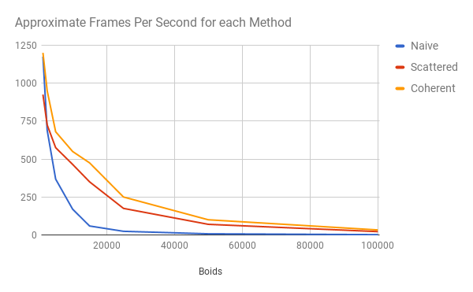
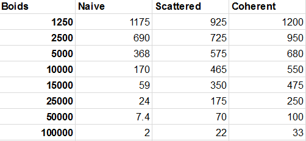

**University of Pennsylvania, CIS 565: GPU Programming and Architecture,
Project 1 - Flocking**

* Daniel McCann
* Tested on: Windows 10, i7-5700HQ CPU @ 2.70GHz, GeForce GTX 970M, 16 GB RAM

### Overview

Above: 100,000 boids simulated on a GTX 970M. Gif is 7FPS, real is 33.

As the first project for GPU programming and architecture, this simulation serves as an introduction to CUDA and memory coherence.

Each 'boid' (particle) in this simulation reacts to neighbors with three rules: it is attracted toward them, repelled within a certain distance, and matches their velocity. Each rule has adjustable radii and weights.

There are three stages to this implementation. The first, naive, has every particle check every other particle. 
The second, called 'scattered,' implements a uniform grid. Each boid belongs to a grid cell in 3D space, and only needs to check neighbors within 8 cells instead of the entire space. The 8 cells are determined by the octant of the cell enclosing the boid; this extra computation is marginal and saves 19 cells of boids (2x2x2 instead of 3x3x3).
The third, coherent, is a small modification to scattered that sorts boid positions and velocities to be coherent in memory, with the ordering determined by the position of its inclosing cells. Thus all of the boids within a cell are coherent in memory, and cells' memory is coherent down the x-axis

Each stage brings a massive improvement on the last, and the coherent approach has trivial implementation differences from the scattered approach.

### Performance analysis

## Algorithm Differences

To compare the solutions without a uniform grid, with a grid, and with memory-coherent boid data, I used the FPS measurement with the visualizer turned off.
FPS measurements fluctuate often in the grid since the runtime is dependent on the worst case of population within grid cells. So with low numbers of particles, the measurements for the scattered and coherent algorithms are ballpark estimates.
Once the particle count reaches 100,000 it stays within a 2 fps range.

For these tests, each rule was as follows:

|Rule # | Radius | Strength |
| --- | --- | --- |
| 1 | 8 | 0.01 |
| 2 | 4 | 0.1 |
| 3 | 5 | 0.1 |

A few things to notice: the minimum number of boids/particles in these measurements is 1250.
At this stage, the naive method is roughly the same as the coherent grid, and better than the scattered grid. With very low numbers of particles, it should be the best method.

Memory coherence was a massive benefit to FPS. My measurements show an 18% increase at the minimum, and this is for the least precise measurements. At 100,000 particles, it gave a 50% increase in FPS, from 22 to 33. This is further aided by picking grid cells in a memory-coherent order, making four pairs of cells with completely coherent reads for particles.

## Cell Size

I tested FPS with 100,000 particles with a memory-coherent uniform grid.

| Radius | FPS |
| --- | --- |
| 16.0 | 6 - 8 |
| 12.0 | 13 - 14 |
| 8.0 | 32 - 33 |
| 4.0 | 122 - 123 |

As the radius increases, the particles are divided into fewer cells, thus each particle must check more neighbors. This, of course, converges to a worse version of the naive algorithm.

## Block Size

Using the same rules outlined in Algorithm Differences, 100,000 particles and coherence:

| Size | FPS |
| --- | --- |
| 16 | 17 - 18 |
| 32 | 30 - 32 |
| 64 | 31 - 32 |
| 128 | 32 - 33 |
| 256 | 30 - 31 |
| 512 | 30 - 31 |

Varying block sizes have only marginal differences for this algorithm at this number of particles. 128 is ideal (barely) and 16 is a significant downgrade from 32. This makes sense because each block will not have a full working warp.
256 and 512 are marginally different. My GPU has a max block dimension of (1024, 1024, 64).

