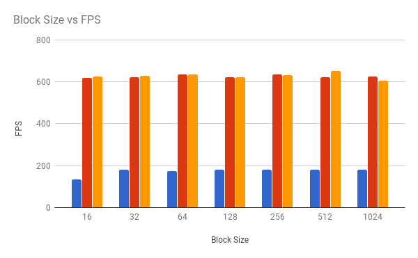

**University of Pennsylvania, CIS 565: GPU Programming and Architecture,
Project 1 - Flocking**

* RISHABH SHAH
* Tested on: Windows 10, i7-6700HQ @ 2.6GHz 16GB, GTX 960M 4096MB (Personal Computer)

### Boids Flocking Simulation on GPU

*simulation result of 5000 boids using coherent grid*

In this simulation, boids (particles) move in space interacting with nearby boids based on three rules: Cohesion, Separation, Alignment. At every timestep, these rules define the new velocity of every boid.

The simulation was done using three methods
- Naive - Here, we check every boid with every other boid, regardless of the distance.
- Scattered Grid - This one is a bit smarter. Here, we divide the space into a uniform grid, and only check the boids in the nearby grid cells around the boid.
- Coherent Grid - Because of the way the GPU works, the scattered grid implementation doesn't work as efficiently as it should. On a GPU, accessing neighboring values in arrays is much faster than accessing far of values. So, we rearrange the position and velocity arrays from the scattered grid implementation and make them coherent. This gives considerably faster performance for high boid counts.

Skipping cells based on neighborhood distance: Instead of just looping over the boids from the nearby cells, I determine if a part of the neighborhood lies in the cells. If it does, only then, the boids of the cell are considered.

#### Performance Analysis
*NOTE: All the timings were calculated as an average over 15 seconds.*
- Number of Boids:
    -   As expected, the frame rate drops with the increase in number of boids.
    -   When the number of boids is low (about 1000), naive is the fatest. This must be because of the overhead of the additional calculation that are needed for grid based implementations. The number of boids is so less, it is better to just compare every boid with every other boid, tham to do the additional calculations.
    -   As the number of boids increases, the benefits of using grid based implementations are seen.

        *Analysis with visualization off*

        

        

        *Analysis with visualization on*

        

        

-   Block Size:
    -   Change in frame rate can be seen as block size increases from 16 to 32. Probably because half of the threads in the warps were idle with block size of 16. A little performance increase can be seen upto 64 or 128.
    -   After 128, there is not much difference.

        *Analysis with visualization off*

        

        

-   Cell Width:
    -   Grid cell width directly affects performance, as increasing it, increases the number of grid cells to be processed, but also decreases the number of boids in each cell.
    -   The performance for half the original cell width was quite better for all the methods.
    -   As can be seen in the data below, the performance actually increased when doubling the boid count from 5000 to 10000. Same thing happens with original cell width. I have no clue why.

        *Analysis with visualization off*

        

        

-   Comparison:
    -   This is a comparison of the performance changes with visualization on, visualization off, and with smaller cell size (+ visualization off)

    
