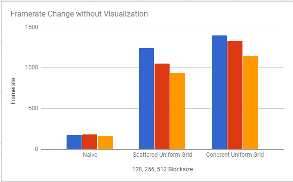

**University of Pennsylvania, CIS 565: GPU Programming and Architecture,
Project 1 - Flocking**

* Ricky Rajani
* Tested on: Windows 7, i7-6700 @ 3.40GHz 16GB, NVIDIA Quadro K620 (Moore 100C Lab)

**5,000 Boids on Coherent Uniform Grid**

**50,000 Boids on Coherent Uniform Grid**

**100,000 Boids on Coherent Uniform Grid**

### Performance Analysis

