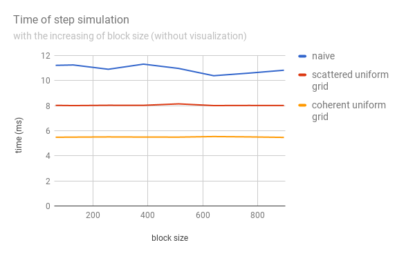

**University of Pennsylvania, CIS 565: GPU Programming and Architecture,
Project 1 - Flocking**

* Yalun Hu
* Tested on: Windows 10, i7-6700HQ CPU @ 2.60GHz 32GB, GTX 1070 8192MB (Personal computer)

# Flocking

# Features

* Naive Boids Simulation
* Scattered uniform grids Boids Simulation
* Coherent uniform grids Boids Simulation

# Performance Analysis

Methods for measuring performance:

**Framerate change:**
In main.cpp, add variables and loops to record fps in first 1000 calls of mainLoop() function, and average them to get the average fps.

**Time of step simulation:**
In main.cpp, add variables and loops to record step simulation time in first 1000 calls of runCUDA() function, and average them to get the average step simulation time.
The elapse time of step simulation is computed by cudaEvent.

## Performance plots

### 1. Framerate change with increasing # of boids

* with visualization

  

* without visualization

  

### 2. Framerate change with increasing block size

  

### 3. Step simulation time with increasing # of boids

* with visualization

  

* without visualization

  

### 4. Step simulation time with increasing block size

  

## Questions and answers

**1) For each implementation, how does changing the number of boids affect performance? Why do you think this is?**

The increasing of the number of boids leads to the decreasing of performance. Since there are more neighbors needed to be check.

**2) For each implementation, how does changing the block count and block size affect performance? Why do you think this is?**

Changing the block count and block size does not affect performance.

**3) For the coherent uniform grid: did you experience any performance improvements with the more coherent uniform grid? Was this the outcome you expected? Why or why not?**

There are performance improvements in fps and runtime when the number of boids is big. But when the number of boids is small, the coherent uniform grid method does not improve the performance.
I think it's because when the number of boids is big, neighborhood distance is much smaller than the full simulation space. When the number of boids is small, the neighborhood distance is not such small, and the code length of the coherent uniform grid is longer than naive method.

**4) Did changing cell width and checking 27 vs 8 neighboring cells affect performance? Why or why not?**

It will not affect the performance.
