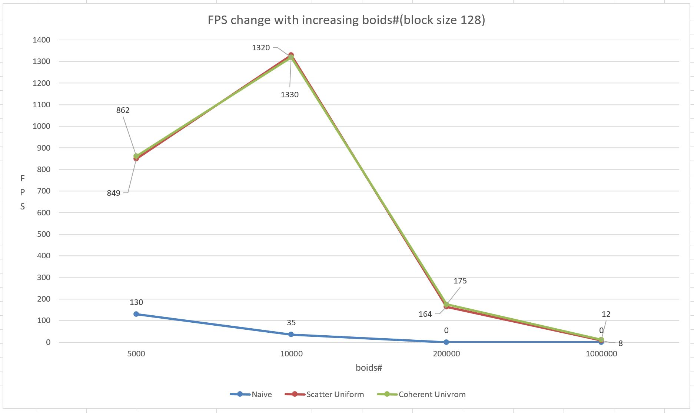

**University of Pennsylvania, CIS 565: GPU Programming and Architecture,
Project 1 - Flocking**

* Hanming Zhang
* Tested on: Windows 10, i7-6700K @ 4.00GHz 16GB, GTX 980 4096MB (Personal Desktop)

## Hanming Zhang

## Screenshot

## Gif

## Performance Analysis
**all performance testing data are from release mode, visualization disabled, and NVIDIA V-Sync off. FPSs are basically approximate average value after program runs for some time**

* **increasing block size table**

Block Size | Naïve(fps) | Scattered Uniform(fps)  | Coherent Uniform(fps)
------------ | ------------- | ------------- | -------------
64 | 131 | 849 | 862
128 | 130 | 832 | 822
256 | 130 | 778 | 822
512 | 124 | 793 | 834

* **increasing block size graph**

* **increasing boids# table**

boids# | Naïve(fps) | Scattered Uniform(fps)  | Coherent Uniform(fps)
------------ | ------------- | ------------- | -------------
5000	| 130	| 849	 | 862
10000	| 35	| 1330 | 1320
200000|	0	  | 164	 | 175
1000000|	0	| 8	   | 12

* **increasing boids# graph**

* **analysis:**
  * According to the data we listed above, if we keep boids number unchanged and increase our block size, fps of all three methods changes very slightly. In case of scattering uniform method, however, it drops around 50 fps from 64 block size to 512. It may be explained as 64 block size has a better utilization of SMs. Say if we have total 1024 threads and 16 GPU SMs, then we have 1024 / 64 = 16 blocks. In this case, we can run all 16 GPU SMs. However, if 512 block size, then we have 2 blocks, only 2 GPU SMs are really utilized and other 14 are just wasted.

  * Not clear why fps increase when boids number increase from 5000 to 10000, if you have any clues, please leave comment to me.(I have tries many times, yes, it increases.). What I am thinking is that maybe boids in grid are sparse in case of 5000, so it won't influence much when increases to 10000.(But I still don't know why fps increase so much...). In other cases, fps just drops, because we have more threads and block need to be processed. 

  * Coherent uniform grid doesn't improve performance so much in our cases, or they only improve very slightly in some cases. This is understandable because our unit grid weigh is two times the maximum search radius, which means we only need to find 2 valid cells in any directions(totally 8), so whether our grid is coherent or not won't influence much and there are only two cells after all. However, if we largely increase our search radius, our performance will definitely improve, since we can access
   several cells' position or velocity in just one time instead of accessing each of them.
  * Checking 27 cells will influence performance, because we need to speed more time on our searching loop.

  * Performance of scatter uniform and coherent uniform methods we use above can sometimes be unstable, especially the coherent one. FPS can vary around 100 fps between two frames(apparent when fps is high). This can explained that sometimes there may be some many boids in just one cell, so the time we spend on looping boids from start index to end index largely increase.

  * Capturing and tracing CUDA and OpenGL in NVIDIA performance analysis itself will influence performance, fps is generally 20%-30% lowering during the capturing process(this is very apparent when fps is high), and increase after capturing process finished.

  * According to NVIDIA Performance report, thrust::sort_by_key method we use takes up most of the run time. 5 of 6 functions that uses time most are part of that sorting method. The third time-consuming function is the UpdateVelNeighborSearch method I implemented.
