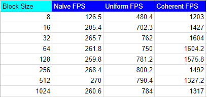

**University of Pennsylvania, CIS 565: GPU Programming and Architecture,
Project 1 - Flocking**

* Rudraksha D. Shah
* Tested on: Windows 10, i7-7700 @ 2.80GHz 16GB, GTX 1050 4096MB (Personal Computer)

### Boid's Flocking Simulation
-----------------------------

- The simulation contains 100000 boids.


### Boids's Flocking Simulation Rules

------------------------------------
__1. Cohesion:__ Boid's in a given neighbourhood follow each other. They move together towards the perceived center of mass of their neighbours.

```
function rule1(Boid boid)

    Vector perceived_center

    foreach Boid b:
        if b != boid and distance(b, boid) < rule1Distance then
            perceived_center += b.position
        endif
    end

    perceived_center /= N-1

    return (perceived_center - boid.position) * rule1Scale
end
```

__2. Seperation:__ Boid's avoid getting too close to their neighgbours

```
function rule2(Boid boid)

    Vector c = 0

    foreach Boid b
        if b != boid and distance(b, boid) < rule2Distance then
            if |b.position - boid.position| < 100 then
                c -= (b.position - boid.position)
            endif
        endif
    end

    return c * rule2Scale
end
```

__3. Alignment:__ Boids align and try to move in the same direction and in the same speed as their neighbours. 

```
function rule3(Boid boid)

    Vector perceived_velocity

    foreach Boid b
        if b != boid and distance(b, boid) < rule3Distance then
            perceived_velocity += b.velocity
        endif
    end

    perceived_velocity /= N-1

    return perceived_velocity * rule3Scale
end
```

### Implementation Methods
-----------------------------------
There are three ways to implement the Boid's flocking simulation on the GPU using CUDA.
    
    1. Naive (Brute Force) Implementation. 
    2. Uniform Grid Implementation
    3. Coherent Grid Implementation

__Naive Implementation:__  Following the three rules for aligning any boid with its neighbour is relatively easy and fast. The biggest bottle neck of the simulation process is to find the neighbouring boids that are close to a given boid and that influence the boid's direction and speed. One way to find the neighbours is the brute force way where for each boid we loop through all the other boids in the simulatioin checking if any are close enough to be inside the neighbourhood distance> Using those boids to update the velocity and ditrection of the boid.

__Uniform Grid implementation:__ There is a very obvious flow with the Naive implementation. looping over every boid in the simulation per frame is very inneficient and time consuming process. In a sufficiently large simulation space as compared to the boid size and neighbourhood distance each boid will be influenced by only a small subset of boids. In this case it will be more efficient to reduce our search space to only a small subsets of the boids that are near the boid and have a high probablity of being inside the neighbourhood distance. And what better way to optimise this process than to use spatial data structures. 

In this case we will make a unifrom grid of cells and as a pre-computation to the upadte velocity step we will bin the boids in cells based on thir position. 


Using this information we can search a narrow space of cells around the boid, culling our search space.


You can build a uniform grid on the CPU by iterating over the boids, figuring out
its enclosing cell, and then keeping a pointer to the boid in a resizeable
array representing the cell. However, this doesn't transfer well to the GPU
because:

1. We don't have resizeable arrays on the GPU
2. Naively parallelizing the iteration may lead to race conditions, where two
particles need to be written into the same bucket on the same clock cycle.

Instead, we will construct the uniform grid by sorting. If we label each boid
with an index representing its enclosing cell and then sort the list of
boids by these indices, we can ensure that pointers to boids in the same cells
are contiguous in memory.

Then, we can walk over the array of sorted uniform grid indices and look at
every pair of values. If the values differ, we know that we are at the border
of the representation of two different cells. Storing these locations in a table
with an entry for each cell gives us a complete representation of the uniform
grid. This "table" can just be an array with as much space as there are cells.
This process is data parallel and can be naively parallelized.


The buffers allocating for implementing spatial grid structure

- `dev_particleArrayIndices` - buffer containing a pointer for each boid to its
data in dev_pos and dev_vel1 and dev_vel2
- `dev_particleGridIndices` - buffer containing the grid index of each boid
- `dev_gridCellStartIndices` - buffer containing a pointer for each cell to the
beginning of its data in `dev_particleArrayIndices`
- `dev_gridCellEndIndices` - buffer containing a pointer for each cell to the
end of its data in `dev_particleArrayIndices`.

__Coherent Grid Implementation:__  The way we implemented uniform grid one problem arises is that the position and velocity arrays are not sorted and aligned with the `dev_gridCellStartIndices` and `dev_gridCellEndIndices` arrays. One way to overcome this problem is to create new buffers that store and align with the cell sorted boid index arrays. This will reduce the overhead of accessing the boid array when calculating and updating the velocity of a boid.


### Performance Analysis
--------------------------------------


__Change in frame rate with increasing boid count:__

- This analysis was performed with a block size of 128 and the visulization turned off.
- The graph shows the performance of the three simulation implementation methods for varying boid size.

 


__Change in frame rate with increasing block size:__

- This analysis was performed with a boid count of 5000 with visulization turned off.
- The graph shows the performance of the three simulation implementation methods for varying block size.




Question 1. For each implementation, how does changing the number of boids affect performance? Why do you think this is?

Answer: Changing the number of boids has a varying affect on each implementation. But overall the effect of increasing the boid count decreases the frame rate and performance. For Naive with a lower boid count the frame rates are interestingly very high but decrease drastically as the number of boids increase. For spatial grid without coherence the initail frame rate for lower boid count is not very high rather it is consistent for the initial increase in the boid count but decreases rather drastically as the boid count increases from a certain level. For coherent grid the frame rate is consistent in the begining just like the uniform grid but unlike the uniform grid it gradually reduces as the boid count increases.

Question 2. For each implementation, how does changing the block count and block size affect performance? Why do you think this is?

Answer: The coheherence in the boids position and velocity values had a positive affect on the simulation. As the coherence of the data reduced the memory calls duration which inturn helped in speeding the implementatio. Also as the data was coherent the performance of the simulation also became more reliable and stable. The dropoff in the system performance as seen in the graph above with the increase in boid count is more gradual than drastic as compared to scattered uniform grid implementation.

Question 3. For the coherent uniform grid: did you experience any performance improvements with the more coherent uniform grid? Was this the outcome you expected? Why or why not?

Answer: Yes, for a block size lower than 32 which is the warp size the performance took a hit but as the warp size inicrease beyond 32 the performace increasd. This is because per block a lot of threads would be wasted when the block size is lower than 32.

Question 4. Did changing cell width and checking 27 vs 8 neighboring cells affect performance? Why or why not?

Answer: Initially as the number of cells increase the performance reduces but as the number of boids increase the performance improves for the 27 cell case as compared to the 8 cell case. This is because we are checking the space with a higher density and thus the search space has a higher probablity of boids that are in the neighgbourhood when we check 27 cells as compared to 8 cells.

### Reference
--------------------------------------
Based on [Conard Parker's notes](http://www.vergenet.net/~conrad/boids/pseudocode.html)
