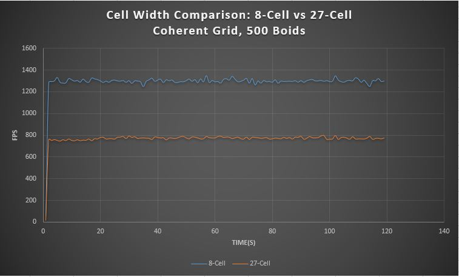

**University of Pennsylvania, CIS 565: GPU Programming and Architecture,
Project 1 - Flocking**

* Jiawei Wang
* Tested on: Windows 10, i7-6700 @ 2.60GHz 16.0GB, GTX 970M 3072MB (Personal)

## Results
___

The result above is **"Coherent Boids Flocking"**. The Parameters are as below:
* *N_FOR_VIS* = `10000`
* *DT* = `0.2f`
* *blockSize* = `128`
* *rule1Dsitance* : `5.0f`
* *rule2Distance* : `3.0f`
* *rule3Distance* : `5.0f`
* *rule1Scale* : `0.01f`
* *rule2Scale* : `0.1f`
* *rule3Scale* : `0.1f`
* *maxSpeed* : `1.0f`
* *scene_scale* : `100.0f`
* *width * height* : `1280 * 720`
* *pointSize* : `2.0f`

## Performance Analysis
___

### Performance testing:

The performance of ***Naive Boids***, ***Uniform Boids*** and ***Coherent Uniform Boids*** is measured using FPS along with the time.

According to the plots above, it's easy to find out that the efficiency of each simulation decreases with the increasing number of the boids. Also, ***Coherent Uniform Boids*** > ***Uniform Boids*** > ***Naive Boids***.

### Questions

* ***For each implementation, how does changing the number of boids affect performance? Why do you think this is?***

As the ***Performance Testing*** shows, When the number of the boids increase, the performance of all these three method will be worse.

In ***Naive Boids***, the time complexity of the updating velocity of boids will be **O(n)**, 'cause we need to iterate through all **n** boids to compute the distance. Thus, the increasing of **n** will slow down the performance.

In ***Uniform Grid Boids***, we only examine the boids inside of the nearby cells(8/27), but when the total number of the boids increase, it's reasonable that the number of the boids inside of the nearby cells will also increase, and this will increase the computation time during the updating of the velocity.

In ***Coherent Uniform Boids***, it's similar to the ***Uniform Grid Boids***, except that it uses the continuous memory to store the velocity and position, but they are facing the same situation.

* ***For each implementation, how does changing the block count and block size affect performance? Why do you think this is?***

The comparison results is as following:

As the plots show, the changing of the 'blockSize' doesn't affect the performance of ***Coherent Grid Boids***, but the increasing of the 'blockSize' does decrease the performance of ***Uniform Grid Boids*** remarkably. 
The reason is that for ***Uniform Grid Boids***, the data in the global memory is scattered, it's really time-consuming for the threads inside of one warp try to access not continuous memory during the execution. and when the blockSize increases, the number of the threads inside of one block will increase, and this will cause the arrangement of the threads will be more continuous while the memory it is about to access is still random.

* ***For the coherent uniform grid: did you experience any performance improvements with the more coherent uniform grid? Was this the outcome you expected? Why or why not?***

I expected that there may be tiny improvment of the performance, because even the optimized memory will decrease the time of the memory accessing, but we still need to rearrange the memory during every update. 

However, the rearrangement can be done in parrallel, and it also only need one time to access `particleArrayIndices` during each thread, it's the same as before. And after rearrangement, the threads in the same block will access the continuous memory which is much more efficient than accessing scattered memory. 

* ***Did changing cell width and checking 27 vs 8 neighboring cells affect performance? Why or why not?***

For 27 cells, I set the cell width equals 1.0 * ruleDistance(2.0 for 8 cells), in this case, we have to checking 27 cells nearby the each particle. The results are as following:

The results are really interesting:
In both methods:
* When the number of boids is **large**, the performance of 27-cell is better.
* When the number of boids is **small**, the performance of 8-cell is better.

I think the reasons are as following:
* Assume that the `ruleDistance` equals to 1,
   * in 27-cell case, the `CellWidth` will equal 1, the total volume are `27 * (1 ^ 3) = 27`;
   * in 8-cell case, the `CellWidth` will equal 2, the total volume are `8 * (2 ^ 3) = 64`;
   * in both cases, the number of the valid boids(the boids inside of the distance range) are equal, but in 8-cell case, you have to check more boids due to its larger volume.
   * So 8-cell method will cost more time than 27-cell on boid-distance computation.
* 27-cell method has to loop more times than 8-cell on examining of the cells, which means it will spend more time on accessing the start/endIndicesArray.

Therefore,
1. When the number of boid is **large**, the 8-cell method will check much more boids than 27-cell method, so the boid-distance computation will be the bottleneck of the algorithm.
2. When the number of the boids is very **small**, the boids will be very sparse in the space. This means even in 8-cell case, you only have to check several more boids. So in this case, the more times of looping will be the bottleneck of the algorithm.
