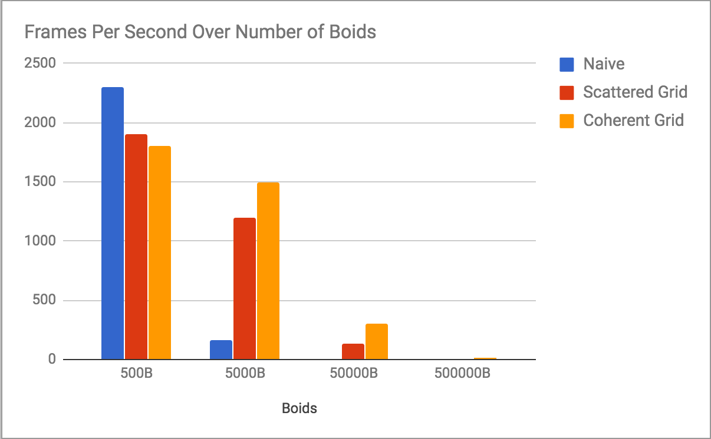

**University of Pennsylvania, CIS 565: GPU Programming and Architecture,
Project 1 - Flocking**

* William Ho
* Tested On: Windows 7 Professional, i7-6700 @ 3.40 GHz 16.0GB, NVIDIA QuadroK620 (Moore 100C Lab)

Include screenshots, analysis, etc. (Remember, this is public, so don't put
anything here that you don't want to share with the world.)

The machines in Moore 100C seemed to lack a method of video screen capture. Below are screenshots of a simulation of about 7500 boids progressing. 

Boid Count: 7500
Implementation: Uniform Grid

The following graphs illustrate performance changes based on changes in parameters. Each graph represents a change in only 1 parameter, and where otherwise specified, baseline simulation parameters are as follows:

Threads per Block: 128
Cell Width: 6.0f
Number of Boids: 5000
Grids Queried: 8

This Flocking Boids project showcases 3 implementations of flocking behavior:

A naive approach that checks each boid against each other boid and two uniform grid approaches(scattered and coherent). The second uniform grid approach preprocess position and velocity into buffers to optimize memory access (coherent uniform grid). The coherent uniform grid out-performs the scattered uniform grid by minimizing cache misses, and lowering the number of global memory reads that are required per thread. 

Here, we can clearly see the difference in how our implementations can scale. Uniform grid implementations are intended to be more efficient than a naive approach because they cull unnecessary comparisons. Of course, the trade off is the overhead of building the grid data structure, and at low numbers of boids, this cost actually out weighs the benefits. But it is clear that to quickly simulate orders of magnitudes of more boids, a uniform grid is necessary.

In this project, block size did not appear to create significant performance differences. Our naive implementation benefited modestly from higher numbers of threads.

Changing grid cell width comes with its tradeoffs. Smaller grid cells require more overhead to store and maintain the uniform grid data. Working in 3 dimensions, such memory requirements could balloon. Larger grid cells, on the other hand, are likely to contain more boids, and do not cull as effectively. 

Unsurprisingly, the benefit of scanning only 8 grid cells instead of 27 is significant. 
