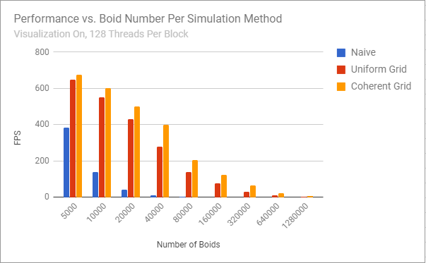
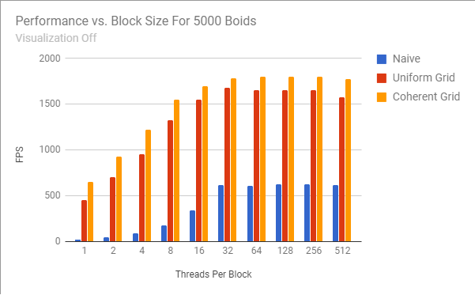
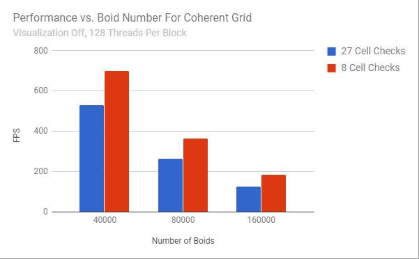

**University of Pennsylvania, CIS 565: GPU Programming and Architecture,
Project 1 - Flocking**

* Joseph Klinger
* Tested on: Windows 10, i5-7300HQ (4 CPUs) @ ~2.50GHz 2B, GTX 1050 6030MB (Personal Machine)

### README

In this project, we are attempting to simulate the motion of "Boids," which move each frame according to the properties of their neighbors. This can be done a number of ways,
one of the better ones being to utilize a spatial uniform grid to accelerate the processing of each boid being simulated. On the CPU (even with an acceleration structure such as a uniform grid in place),
we would be forced to iterate over each boid to process them individually, which is valid, but doesn't scale up well. So, we harness the power of the GPU through CUDA to simulate these Boids in parallel.

The naive way of computing how a Boid should move is to check every other Boid in the simulation. However, Boids have a finite (and usually small) neighborhood radius, and only are affected by Boids within that radius.
Ideally, we do not have to bother checking faraway Boids that will have no effect on the Boid in question. As mentioned before, a Uniform Grid is utilized to narrow down the Boids that must be checked to only those in the
cells next to a given Boid. To further accelerate things, steps are taken to ensure that the arrays containing the Boid information (position and velocity) are arranged in the same way as the uniform grid indices for faster
read times - see INSTRUCTION.md for more.

### Analysis

**Data**

I'm just going to throw some stats at you to start. Here are how the various implementations performed:

Here we see that the naive implementation falls off rather quickly, as we would expect. The uniform grid makes the most significant optimization (again as we would expect), as we are cutting out
the vast majority of unnecessary-to-check Boids in the simulation. The coherent memory optimization, which allows the simulation to reduce the number of pointers dereferenced to global memory, is still appreciably better than 
that, and moreso than I was expecting. The increased performance is welcome, though.

Turning off the visualization allows for awesomely high performance, but the overall pattern remains the same. This jump in performance was actually much higher than I was anticipating - I knew draw calls in OpenGL could be
costly, but we can see that it really cut down on the overall performance of the simulation in the first graph.

Here I analyzed the performance versus the number of threads per block for each method at 5000 Boids. As we will discuss below, the warp size on my laptop's GPU, the GTX 1050, is 32, so the performance plateaus after 
increasing the blocksize to 32, as expected.

**Questions:**
* Changing the number of boids:
Changing the number of boids, or the input "N" to our simulation, has the most direct effect on the performance of the simulation.
Each method (Naive, Uniform Grid, Coherent Grid) processes each boid to compute a new velocity (for that boid).
Each method must take into account a subset of the other boids to do this. So, the method that can take into account as few of
the other boids for a given boid will perform the best. Obviously, taking into account every other boid (Naive) will perform far worse
than taking into account only the nearby boids (Uniform Grid).

* Changing the number of threads per block:
By changing the block size (and therefore block count), we are directly altering exactly how many boids are processed in parallel at a time. Given that on a GTX 1050, a maximum of 32 threads can be processed at once
in parallel, it makes sense that performance increase would plateau after increasing the number of threads per block to 32, as seen in the third graph above. Any number lower than 32, and the SMs aren't being used to their full
potential (not every thread in a warp of 32 threads would be active), and so we witness less performance.

* Experiencing performance improvements with the more coherent uniform grid:
Comparing to the scattered uniform grid implemenation, adding memory coherence to the boid position/velocity arrays added a 10 - 40% performance increase (!!!) in certain cases, which is very appreciable! This was higher than
I was initially expecting, but it puts into perspective how costly it can be to derefence pointers to global memory repeatedly. In future projects, I will be sure to incorporate optimizations such as this.

* Did changing cell width and checking 27 vs 8 neighboring cells:
Intuitively, we know that checking more cells than is necessary will negatively affect performance. Given that the grid cell size is two times the neighborhood distance, in three dimensions, only 8 grid cells even need to be checked.
However, here is a brief analysis on how the performance compared, for the coherent grid on a selected number of Boids:

As expected, we experience a pretty severe performance hit, so it is vitally important that we utilize the fact that only 8 grid cells need to actually be checked.